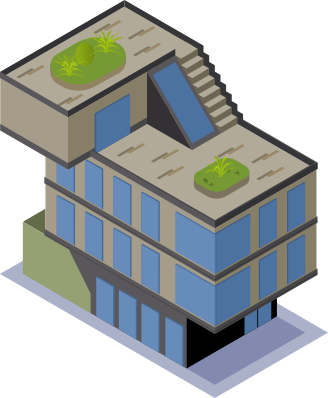
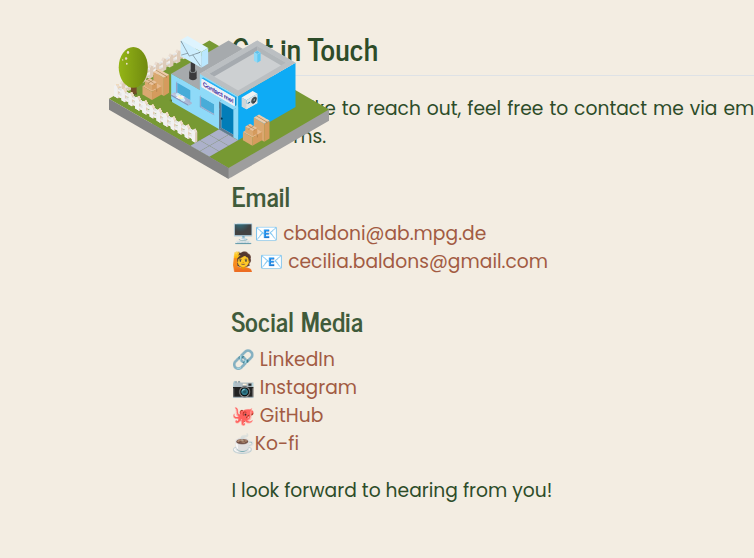
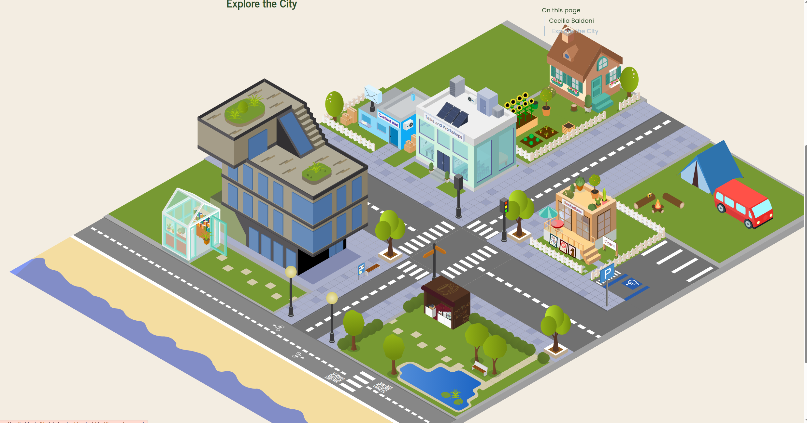
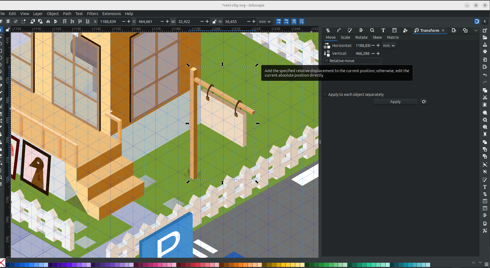
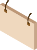

If you've landed on my homepage, you've met the city.
It's an illustrated Cozy Ceci City where each building is a different part of what I do: research, teaching, blog, writing, and clicking one takes you somewhere on my site. People ask me about it fairly often, including complete strangers, with the most asked question being always a variation along the theme of "how did you *do* this" (with *do* often interchanged with *plan*, but joke's on them because I never planned anything). 

I never kept a journal of how this thing came together, which is a slightly embarrassing admission so I will take no more questions, thank you. I do have a fairly good memory of what happened when, or so I think. The good news is that everything was recorded through the commit history of this website's repository, which helped me reconstruct a tidier story. But just for safety let me say this: my commit messages from over a year ago are not written for an audience, and were not planned to be, so I apologize in advance. 

What follows is what the log actually shows, updated in a couple of places by what I remember, and by what the illustration process was (which unfortunately does not have a commit history).
Enjoy!

## One building, twice redone

The first icon I ever made for this project was the research building.



If you squint, it's modeled on the real building of the [Max Planck Institute of Animal Behaviour](https://www.google.com/maps/place/Max-Planck-Institut+f%C3%BCr+Verhaltensbiologie/@47.7664488,8.9912456,15.54z/data=!4m6!3m5!1s0x479a6269c9bad6b5:0x49210c71d76ba18e!8m2!3d47.7680247!4d8.9964188!16s%2Fg%2F1yw0_x3jm), where I worked for more than six years. At the time I drew it, there was no city and no plan for one. 

It's also the only icon in the whole city modeled from somewhere real, which is probably why it took *foooreveeer*. 
I'm unfair, it took forever mostly because it was my first real project with isometric lines in Inkscape. I learned by doing, and I made a lot of mistakes that I would not do today. One of those is starting it with my graphic tablet, instead of a mouse (I can't stress it enough, don't!). 
The second mistake was not to save often. A word to the wise is enough on this topic. 

Whatever the first two attempts looked like, though, I couldn't tell you even if I wanted to. A line-diff on an SVG file says a file changed, never what it used to look like. Whatever they were, they never made it to a saved file or a screenshot on their own. Later mistakes weren't so lucky, like the one you're about to see.

## The jump to a city

The actual starting goal was smaller than a city. I wanted an icon for each of my own `.qmd` pages, research included (later on it got renamed into [Projects](../content/project.qmd)), sitting at the top of its page the way a small drawing sits next to a chapter title.



Somewhere in the couple of weeks after research was finally done, the goal escalated. *Twice.* 
First: what if the homepage itself had one interactive element, something you could actually click, instead of boring text and links. Then, almost immediately after: what if that element wasn't one thing at all, but tiny buildings, a whole city, one per part of what I do. Imagine this thought by a mad scientist gone rogue. 
So that's what happened: from "icon for a page" to "let's build a village" in a couple of weeks. It's either commitment or madness, and I'm fairly sure it's both.

None of that shows up in the `git log`, and it took me a while to understand that's because my most ambitious project creeps entirely offline, and by the time I committed anything the decision had already been made and fully executed. The very first commit to touch any of this, back in March 2025, already contains six finished buildings and the entire skyline underneath them: [contact](../content/contact.qmd), [home](../content/about.qmd), [illustrations](../content/illustrations.qmd), [open science](../content/open-science.qmd), [talks and workshops](../content/talks.qmd), and [research](../content/project.qmd#current-research).

Nine days later, every building and the whole background got rewritten in a single commit. What actually surprises me, looking back at it now, is that I took time to make my village *nice*! I added benches, streetlamps, a bus stop, trees... A whole sheet of texture that hadn't existed on day one. 
I don't remember deciding the place needed personality. What I do remember is where the idea came from: the [Max Planck Society's own website](https://mpgcity.mpdl.mpg.de/), an illustrated city where different buildings point at different institutes and programmes. 

## What the log actually shows

The goal, once it existed, was simple: a homepage where every part of what I do gets its own building, and clicking one takes you to the real page behind it. Straightforward.
Everything after that sentence was execution, and the execution is where over a year of small, occasionally embarrassing mistakes actually live, starting with **the size of the canvas**.

That number changed three separate times as the artwork grew: starting at roughly 4715 by 2824 pixels when the city was born, then 5754 by 3235 nine days later, then 5989 by 3508 about six months after that, and finally 5989 by 3718 eight months after that, where it still sits. Every single time the canvas size changed, every single icon's recorded position had to be recalculated, because a position that's correct against one canvas size is wrong against another. Of course it is, and of course it sounds incredibly logical. I cannot tell you how long it took for me to realize that I needed a *system* for it, and not just a swing and a prayer. *More on this topic in the next section.*

The six-months-later resize came bundled with some cleanup, which is a generous way of saying I found things that had been broken for months and fixed (hopefully all of) them. That commit deleted a Google Scholar scraping script that had been sitting inside the same file for who knows how long, doing who knows what, and fixed a run of typos scattered through the icon coordinates, where commas had crept in where periods should be (TL;DR: Inkscape reads its numbers out with a comma. R wants a dot. Don't ask me who is right because I don't care). 

Three days after that came a commit called, without further explanation, "fixed city image." I went in expecting a rewrite and found about fifteen lines changed in each direction, a genuinely small fix. The real rewrite happened two days later: a pier appeared, the talks and workshops icon got redrawn alongside it, and the change was big enough to touch close to four and a half thousand lines across both files. I have exactly one screenshot from around this period, taken while reordering icons after adding a publications page, and in it the beach is still bare: no pier, no umbrellas, nothing but sand. I can't tell you from the commit message what was specifically wrong with the version before the rewrite, only that whatever existed wasn't good enough to keep. Two days is not a long gestation period for a decision like that.

None of this was the end of it, either. A van showed up about six weeks after the big rewrite, to give the blog its own building. A coffee kiosk arrived about three weeks after the pier, so people booking time to chat with me would have somewhere to click. A bookshop and a radio tower joined the following spring, for publications and media, and the canvas got resized one final time to make room. The city has never really stopped growing since the day it first existed as six buildings and a skyline.



Writing all of this in (almost) one sitting was a strange experience, because it's the closest thing I have to a diary of a project I never actually kept a diary of. Instead of dated entries about how I felt, I have terse commit messages and diff sizes, and I have to reconstruct the feeling from the size of the rewrite.

This reads like a thing that got redrawn until it stopped being wrong, by someone who apparently cannot be trusted to remember the order any of it happened in without a log to check.

## How the icons actually line up

The two questions people ask most, once they're done asking whether the city is a single drawing (it is, it's one Inkscape file, everything else layers on top of it), are some version of: how do the icons sit on the background so precisely, and did you do that by hand.

The mechanism is simpler than it looks, but it took some time to tweak it out.
Each icon needs three numbers to sit correctly: its horizontal position, its vertical position, and its width (how big it is agains the background), all information that you can find directly in Inkscape. Once resized to 100% so the width reading is accurate, those numbers get logged for every icon, alongside the total width and height of the canvas itself, in a script called `icon-position.R`.

```{r, eval=FALSE}
# canvas size from Inkscape - find it in "Document Properties"
canvas_width <- 5989.414
canvas_height <- 3718.340

# icons positions and sizes
# X and Y are in the move tab in "Transform"
# Width is in the scale tab, but resize to 100% before checking the width in px
icons <- list(
  contact = list(x = 2254.204, y = 679.325, w = 983.975),
  research = list(x = 1561.630, y = 732.550, w = 1240.664)
  # ...one entry per building
)
```

From there, the script converts each icon's raw pixel position into a percentage of the canvas, and those percentages become plain CSS: `top`, `left`, and `width` for each icon, which makes it a breeze to put them *exactly* on top of the city background.

```{r, eval=FALSE}
calc_css <- function(x, y, w) {
  list(
    top   = round((y / canvas_height) * 100, 2),
    left  = round((x / canvas_width) * 100, 2),
    width = round((w / canvas_width) * 100, 2)
  )
}
```

Working in percentages rather than raw pixels is the entire trick. However large or small the city ends up being rendered on someone's screen, phone or desktop, the icons scale together with the background instead doing each their own thing (guess how did I figure it out? By failing again and again), because every position is relative to the same canvas rather than fixed to an absolute pixel count. 

So the answer to "is it precise because you're careful with a mouse" is "No, I'm never precise with a mouse". 

## The most recent addition finally moves

I can't walk you through the whole city, but I can walk you through this one small piece, start to finish.

I wanted something in this city to move, ever since the very first building went up, and had no idea how to make that happen. The [Max Planck Society's own city](https://mpgcity.mpdl.mpg.de/), the one that inspired this whole project, actually has moving elements on it. And they look SO COOL.

So the most recent addition is small on purpose, I wonder if you noticed it yet! The illustration icon has a banner, hanging off a plank near the illustration building, that actually swings. 
Getting that one small swing to work took four separate wrong turns, and for once I have the receipts, because I was watching it happen instead of reconstructing it later from a commit message written by someone in a hurry. So I hope you enjoy it. And I promise I will take care of recording my future changes on the city.

**Attempt 1: guess and hope**

First pass, I made the banner. There was a previous version of it in the original illustration icon but I wanted an element that could actually move, and the old one was too bulky. This took a surprisingly short amount of time (15-20 minutes) if you compare it to the whole week it took me to make the first icon, and it makes quite sense.
Once it was existing, I exported it as a separate `.SVG` element and placed it where all the other icons live.The first thing whenever a new icon gets added, is to run the `icon-position.R` script, with the values from Inkscape. 


The problem was that this step happened *a bit later* and I decided to update the css without doing this step:

```
.banner {top: 25%; left: 70%; width: 8%; }

```

Notice the random numbers?
Not my finest hour. 

**Attempt 2: the wrong half of the drawing**

I fixed the numbering and went back into Inkscape to recheck, on the theory that the commas were points and [Snarks were Boojums](https://en.wikipedia.org/wiki/The_Hunting_of_the_Snark). But all looked good.
To make it swing, I then realised that the actual flag part of the banner needed to be saved on its own, otherwise the *whole* object would swing. When do you think I realised it? Not at this point, sothere was a moment where my website had a swinging post (banner and all).
But it was an easy fix, the flaf is the object to animate, and the post must be part of the background.




**Attempt 3: ask someone to actually look**

The div still would not sit where the numbers said it should, and by this point I had read the same three lines of CSS often enough that I could no longer see them. So I did what I do in these situations and I went crying to an LLM. 
"Why is the banner not moving? I don't see it anywhere, where it is? All my css code is perfect as you can see"

Well, the correct numbers had been sitting right there the whole time, doing absolutely nothing, because a browser only obeys a position once an element is permitted to have one. The line that fixed it was: `position: absolute;`.

The banner now swung beautifully, and at the top of every swing, a second, perfectly static banner peeked out from underneath it. Damn it!

**Attempt 4: remembering the layers**

Remember when I said that the post had to be in the background, but not the flag? Well, I did not do it. I kept the whole illustration in the background, and on top of it I added the moving flag. This meant that the swing movement would show the static background of the flag. 
Getting rid of it meant going back into the illustration artwork itself, which is where the day found a way to teach me the exact same lesson from the very first section of this post. I got absorbed, didn't save for a while, and Inkscape froze solid. I lost a genuinely upsetting amount of years from my life while I waited for Inkscape to come back to its senses, which it did. 
For the second occasion in this city's entire history, I have apparently learned nothing at all from the first one, a major lost-city-rebranding disaster (yes, that happened, and no, today is not the day I tell that story).
I am choosing to read that as consistency rather than as a character flaw.

I think of myself as an intermediate CSS coder, which is another way of saying I have opinions about flexbox and no working mental model of what `position: absolute` actually does to an element's coordinate system. I still don't, four wrong turns later. I found the bug, fixed it, moved on. That's apparently fine. The banner swings, finally, after wanting it to for a lot longer than I'd have admitted out loud before writing this. Right now it's the only thing in this whole city that moves. Let's see in a year from now (I imagine a Godzilla coming in and destoying everything, like a sand castle you spent the whole day building).

## Still not done

The city gets new versions. Buildings get added, old icons get redrawn, the pier that showed up in October wasn't there a few days earlier and won't be the last addition either. There's no final version of this thing in sight, and that's what I *love* about this project.

I hope you like this post, if you want to do something similar, or you want more specific information, please [contact me](https://cecibaldoni.github.io/content/contact.html). I would love to help you out!