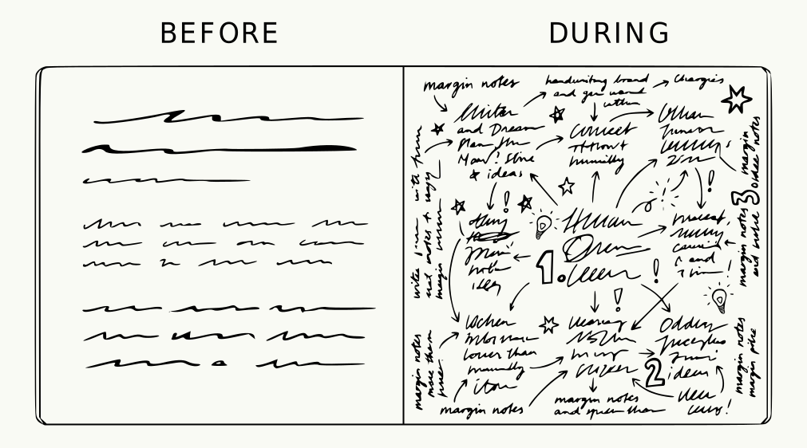

If there’s one truth that governed my recent adult life, is that I’m dependent on note-taking. 
Dependency being the trigger word here: I say that partly as a shamefull confession, partly as as someone showing off their badge of honor. 

Note-taking systems have kept me afloat and alive during my PhD time and beyond. I learned to surf the wave of knowledge and embrace the process that was always almost-done-but-not-quite-ready, to a point where I became the guru you see in front of your screen, sharing my wins and losses to other academics like me. 
I can’t really see my life without note-taking apps. 

Hence, the logical question that follows can only be: **can I survive a week without note-taking apps?**

## Why this, why now

This idea came to me as a result of many different conversation I had with people about using *digital vs analog* to capture thoughts. The consensus seemed to lean towards one **or** the other, and none of these conversation started from *‘let’s use both’*.

People got confused when I replied that I do actively use both, but for different tasks. I mean, can’t we all be friends?

From my side, I never understood why there should be a preference. When did the analog versus digital war started? Where is this idea of necessarily choose one coming from?

That made me think. What do I actually use one or the other for? Are the digital notes more for transcribing meetings, while the analog ones are more for free thinking? Are they interchangeable, based solely on geographic location, access to a keyboard or weather conditions? Or is the limitation cognitive? Was anything of what I was doing real? I could not sleep at night anymore, consumed by the lack of knowledge about myself.

There’s also something to say about the **perceived social acceptance** of digital or analog, and that regards many more aspects than only note-taking. The paradox goes something like this:

If you are team paper: `digital : dependency = analog : wisdom`

Or for digital nerds: `digital : productivity = analog : slowness`

Being who I am, I always need opinion outside my own, and I often find them in journal articles. One [study](https://www.frontiersin.org/journals/behavioral-neuroscience/articles/10.3389/fnbeh.2021.634158/full) out of the University of Tokyo found that writing by hand on paper activated memory-related brain regions more strongly than typing or tapping on a tablet. Encouraging, if you're team paper.

But a [separate line of research](https://www.sciencedirect.com/science/article/abs/pii/S1041608022001303) complicates the picture: when note-taking style was controlled for (meaning: were you transcribing everything verbatim, or actually processing what you heard?), the medium stopped mattering nearly as much. The cognitive benefit, in other words, might have less to do with the pen in your hand and more to do with the fact that you can't type fast enough to be lazy.

**Long story short**: the analog way of life might help your memory, or it might just be that you're paying more attention; and nobody's entirely sure which one it is. The best way to me to form an honest opinion is to run an experiment. Again, I am who I am.

## The Rules of the challenge

No challenge is a challenge without rules to abide to and hypotheses to prove. For this reasons, I lined out the following rules: 

1. **No digital capture, period.** No notes app, no Obsidian or Logseq, no quick phone note, no texting myself on Whatsapp. If it's not on paper, it didn't happen. 
2. **Existing digital notes are read-only.** This is the classic ‘Looking, but no touching’. 
3. **No "It’s just so I don’t forget" rule.** If there’s no paper and the thought escapes, it's gone. That's the point. 
4. **One notebook, one pen**. No elaborate analog setup as a loophole. This isn't a bullet journal rebrand, *for f_cksake*.

*Disclaimer*: the following rule was added mid-challenge. If this was a real experiment I must have started again. But it was only a digital detox, so it was fine. 

5. **No photographing handwritten notes to import them digitally.** The loophole I didn’t think about before starting came to me as a junkie need on Day 2. The funny thing is that I never photographed my analog notes, ever. But after a few days without a digital outlet, I was desperate enough to make it work.

## What I thought would happen

Going in, I was fairly confident about the shape of my suffering: I'd forget things.

Thoughts would escape mid-commute with no phone to catch them. My handwriting, never particularly legible, would become an archaeological study. Handwriting notes while talking (e.g. in meetings) would slow to a crawl. I type faster than I write. *Everyone does.*

The good things felt equally obvious, and I was quite arrongant about it. Everything in one place means that everything is easy to find. 
And the literature, as just established, suggests that writing by hand does something useful to your memory. I was going to come out of this sharper, more present, and insufferable about it.

I was wrong about everything.

## What Actually Happened

```{r}
#| echo: false
#| message: false


# A Week Without Digital Notes — not-peer-reviewable data ----

# Variables tracked:
#   - doodles_per_page: number of doodles / sketches per page
#   - words_per_entry: estimated word count per entry
#   - margin_usage_pct: % of page escaping the main writing area
#
# Period: 7 days before the challenge, 7 days during.
# Data: Statistically dubious.
# -------------------------------------------------------

library(ggplot2)
library(dplyr)
library(tidyr)
library(patchwork)

notebook_data <- readRDS("../data/notebook_data.rds")
col_before <- "#7a8c78"
col_during <- "#c46e3a"

palette    <- c("Before" = col_before, "During" = col_during)

base_theme <- theme_minimal(base_size = 15) +
  theme(plot.title = element_text(face = "bold", size = 16, margin = margin(b = 4)),
        axis.title.x = element_blank(),
        axis.title.y = element_text(size = 12, color = "grey40"),
        axis.text = element_text(size = 12, color = "grey30"),
        legend.position = "none",
        panel.grid.minor = element_blank(),
        panel.grid.major = element_line(color = "grey92"),
        plot.background = element_rect(fill = "#fdfbf7", color = NA),
        panel.background = element_rect(fill = "#fdfbf7", color = NA))

p1 <- ggplot(notebook_data, aes(x = period, y = doodles, fill = period)) +
  geom_boxplot(width = 0.45, alpha = 0.85, outlier.shape = 21,
               outlier.fill = "white", outlier.size = 2) +
  geom_jitter(aes(color = period), width = 0.08, size = 2.2, alpha = 0.6) +
  scale_fill_manual(values  = palette) +
  scale_color_manual(values = palette) +
  scale_y_continuous(breaks = 0:8) +
  labs(title = "Doodles per page",
       y = "Count") +
  base_theme +
  plot_annotation(caption  = "Correlation between doodles and having no other outlet: unconfirmed but suspicious")

p2 <- ggplot(notebook_data, aes(x = period, y = words, fill = period)) +
  geom_boxplot(width = 0.45, alpha = 0.85, outlier.shape = 21,
               outlier.fill = "white", outlier.size = 2) +
  geom_jitter(aes(color = period), width = 0.08, size = 2.2, alpha = 0.6) +
  scale_fill_manual(values  = palette) +
  scale_color_manual(values = palette) +
  labs(title = "Words per entry", y = "Word count (estimated)") +
  base_theme +
  plot_annotation(caption  = "Word count was estimated and dramatised for storytelling purposes.")

p3 <- ggplot(notebook_data, aes(x = period, y = margin_pct, fill = period)) +
  geom_boxplot(width = 0.45, alpha = 0.85, outlier.shape = 21,
               outlier.fill = "white", outlier.size = 2) +
  geom_jitter(aes(color = period), width = 0.08, size = 2.2, alpha = 0.6) +
  scale_fill_manual(values  = palette) +
  scale_color_manual(values = palette) +
  scale_y_continuous(labels = function(x) paste0(x, "%")) +
  labs(title = "Margin usage",
       y = "% of page") +
  base_theme +
  plot_annotation(caption  = "Not-Peer-Rewieable data collection and analysis.")

```


### My brain worked, briefly

Without the option of dropping cognitive load to the nearest digital tool (most often my phone), panic overtook my life. 

At least for a day or two. 
Then I realised that without the option my brain became suspiciously reliable. <br> 
It started remembering things without so much of an effort, like a responsive movement-triggered light when you enter a room. 

The suspicion came from how unreliable my brain have been in the past. I always blamed it on my busyness: too many things to do, to remember. <br> 
But without the crutch of brain dumping, my brain could hold itself pretty well. 

I know it sounds great and productivity gurus might take this as a sign to start a crusade against anything digital, but despite the clear immediate benefit, I hold some reservation on how long that can work without crashing. <br> 

There’s a reason why brain dumping is effective: because it works. <br>  
My guess is that the limited time span in which I avoided this practice was enough for it to work without consequences, but keeping it up for months would have ended in a disastrous constant forgetfulness, neurological mutiny, personality fatigue, and would have ultimately ended with the pagan ritual of feeding notebooks to open fires.

### Everything in one place means nothing is anywhere

The location problem. I talked about this in [another blogpost](https://cecibaldoni.github.io/blog/project-management.html) on how to manage different projects when they live in different media (analog, digital, sticky notes, pidgeon mail, smoke signals). To keep yourself on top of the pile you must not remember what the information is, but *where it is*.

Once you confidently build a system that has things where they belong, you drop the higher cognitive thinking and keep only the spatial navigation skills. Like a spatial map of your thoughts, but that can’t be outsourced to Google Maps.

What happened when everything existed in the same place? You might think it would simplify access. It did not. Without `Ctrl + F`, a notebook is just a sequence of pages with no index and no mercy. I knew I'd written something down. I had no idea if it was before or after Tuesday, before or after this blogpost idea.

Any place, it turns out, is the same place. Chaos ensues.

### Blank Page Syndrome is a myth

The thing about having an empty page is that it is tied with endless possibilities and zero guardrails. In the digital world you somehow start from a note that is nested in a folder. It might have a template, mainly to close the blank page gap with a purposeful force.

You might say that it’s unintended, and it’s *oh so restraining*. Deep down you know you like it.

The lack of structure forced a resemblance of one to eventually emerge, but not before I'd rambled my way through several pages of prose and discursive thinking. This blogpost, for the first time in the history of this blog, was drafted completely by hand. It was a mess.

```{r}
#| echo: false
#| message: false

p2
```

### The notebook got its act together

Organisation popped up in my analog notebook like mushrooms after a rainy week. Before the challenge, it was an unstructured version of my thoughts, *aka* messy by definition. 

The notes never had colour coding, or a specific place in the paging world, and they could not be tagged and stored and organised, defying tag stereotypes while armed with label-neutral pitchforks.

Without the structure the digital tools natively gifts, the analog adopted it gladly (who am I kidding? It did not adopt it gladly, it fought for its hippie freedom at each step of the way and in the end it capitulated).

Analog notes started having date entries, a title, headers and numbered sequences imposed after I'd written across a page in three directions and needed to manufacture a reading order.

It was not as smooth as I make is sound, and somewhat the structure was a reaction rather than an active choice. 


```{r}
#| echo: false
#| message: false

p3
```

### "One more thing", the doodling

The eternal struggle of *digital vs analog* starts from a single item: **doodling.** This is something I did know, of course, it’s not such a groundbreaking realisation. But it’s worth mentioning, because the amount of doodling, plotting and overall sketchnoting increased considerably.

```{r}
#| echo: false
#| message: false

p1
```

## What to take home

The assumption I got most wrong wasn't the one about forgetting things. I did forget things, and it was fine, and my brain handled it with a competence I found mildly offensive given how little credit I'd been giving it. The assumption I got most wrong was that having everything in one place would make things easier to find. It did not.

The other thing I didn't anticipate was how much the structure I'd been outsourcing to digital tools would quietly migrate into my notebook the moment it had nowhere else to go.

So, what did I change about my habits? The honest answer is that I changed almost nothing, except adding more rambling into my analog life. Whether that counts as growth or just more paper used is unclear to me, only time can tell.
