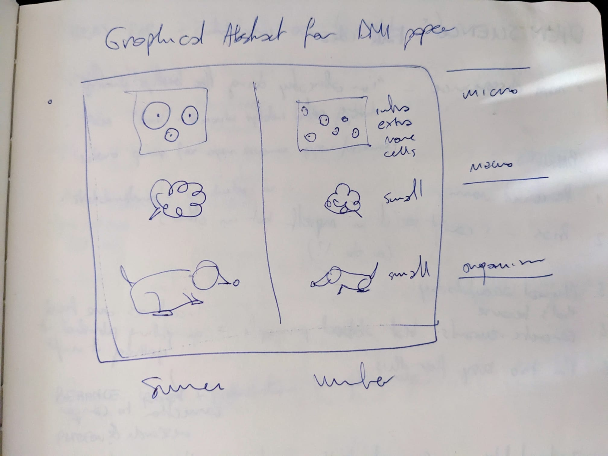
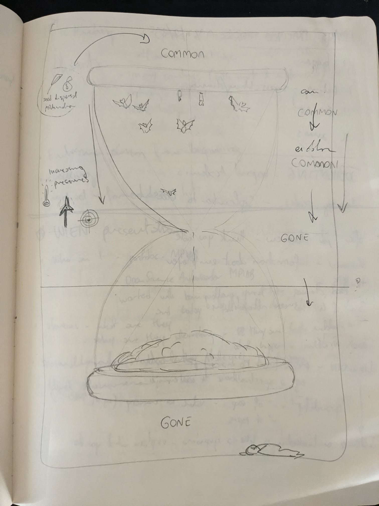
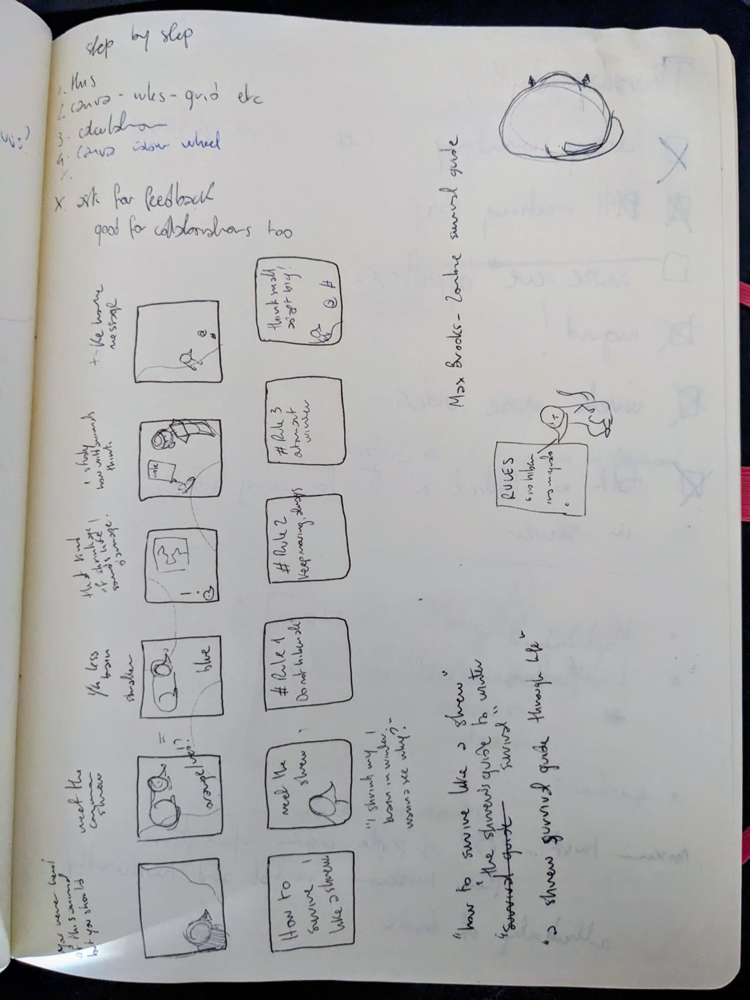

At the end of the week I spent without digital notes, I had a notebook with actual content and no reasonable plan for any of it.

The content was the usual: meeting notes, half-finished arguments (mostly with myself), a blogpost drafted entirely by hand, all topped by a sediment of doodles around the edges. Sin ce the challenge was over, I was supposed to go 'back to normal', which usually means using different tools for different purpuses.

But my normal had a question waiting in it that I had managed to avoid for years: Does this stuff go somewhere?

Of course, for storytelling purposes, this identity crisis is coming right after the self-imposed-no-digital-week, but I need to make this clear: *this is not a one-week problem*.

I have used analog and digital notes alongside each other for as long as I have taken notes seriously, which is most of my adult life. The two have never really touched, like train tracks: they work best once they are at a safe distance from each other and they do not interact.

The notebook is where I think, sketch, and follow a thought around a corner to see where it goes.

The digital side is where things get structured, tagged, analysed, kept so I can find them again in two years.
I always assumed that one day I would build a bridge between them. Maybe a spring-cleaning session where I dutifully copy the good analog bits into Logseq and feel like a serious person.
I am kinda still waiting for the moment when this will be totally necessary. Like an epiphany, or a brainstorming session where I will yell to the void *"See? I need this information **digitalised**!"*

This expectation did not come from nowhere, but was carved into my head at a time where I went looking for how other people handle the same thing Mostly I found advice that assumes you had the epiphany already: *everything good should end up digital eventually, so just digitise it*.

That of course never happened to my notebooks, so I decided to find out what does.

## Do people even read their analog notes?

Before I could ask what to do with analog notes, I had to ask a more embarrassing question.
Do I ever read them again *at all*?

After some soul-crushing introspection, I realised there are two ways I revisit a notebook.

One is what I will define as **lazy flipping**: paging through old entries with no goal, half hoping some good ideas will jump out. It has the same energy as someone hoping their coworker will do the job for them. Although in this scenario, I am both that someone AND the coworker.

For the other one I found a cooler name: **targeted retrieval** (fanfare), where I just know I wrote a specific thing down and I go hunting for it across pages with no index and no mercy.

Lazy flipping is pleasant and almost entirely useless.
Targeted retrieval works, but only if my memory hands me enough of a starting point to know which notebook and roughly which week to open.

I am genuinely not sure which mode does any work, so I will leave that open for a moment. Anyway the answer to my question turned up where I was not looking for it (as usual).

## What I found when I went back

For this post I went through a stack of old notebooks on purpose, with a specific aim for once: *forgotten ideas*.
The whole premise in my head was that years of analog notes must be a graveyard of good thoughts I had written down and then lost, simply because I never copied them anywhere searchable.
Anything would do. Blogposts ideas, talks ideas, illustrations or science communications ideas. There was a hidden treasure up there, for sure.

That was going to be the cautionary tale, because nearly everything I found that was worth keeping, I had already used in whatever form it had turned into since (a paper, a figure, a blogpost, a habit, a paragraph in some other document)

The moral lesson is that the ideas that mattered had survived without ever being digitised. 
Well, that's incomplete: there were other ideas too that I had genuinely forgotten about, those were the ones that deserved forgetting.

This is roughly what the [handwriting research I mentioned last time](https://cecibaldoni.github.io/blog/week-without-digital.html) keeps gesturing at.
Writing something by hand seems to do something to how it sticks, whether that is the hand itself or just the fact that you cannot scribble fast enough to stop paying attention.

I can only report that my own brain, which I have spent years treating as an unreliable source and narrator, had done the archiving I assumed it could not be trusted with (good boy!).

Which finally answers my original question. For me, targeted retrieval is the part that works, and lazy flipping is the hobby. I do not need to anxiously imbibe my notebooks for buried treasure, and I do not need to religiously transcribe everything that happens in there (*pfiuu!*).

## What actually happens to the text notes

So here is the honest accounting of where my written notes end up.
There are two fates, and only one of them involves anything crossing over to digital.

The first and most common is that **the note did its job** and then just stays in the notebook.
A note that held five things in my head through a meeting has spent itself by the time the meeting is over. Eventually, all notes fate to the most unnerving and the most reassuring endpoint: the notebook fills up, and **it goes on a shelf**.

I have a row of finished notebooks living like this, and I have decided to think of that as a valid archive (sue me). I will almost never open them again, and that is apparently fine, because the thinking those notebooks hold was anyway done in my brain.

The second fate is the one the transfer protocol is for: **the ideas**. As I said at the beginning, some ideas start in the notebook in a raw diamond form, and then *need* to be taken somewhere else to be developed. When that happens, I do not copy the original note across.
I rewrite the idea from where it was to where it's going, with new elements, words, bullet points or tags.
The note on paper was the place the thought started, not a piece of luggage I have to carry around forever.

## And another thing! 

I have been talking as if a note is a block of text.
But there is a category that behaves a bit differently, and that is why it needs it's own header.

**The drawings**

::: {layout-ncol="2"}
{height="300px"}

{height="300px"}
:::

And by this I mean anything from sketches and illustration ideas, to the rough plotting diagrams where I work out what a figure should even look like before I make R yell at me about it.

I would like to say that somehow they behave like the first and second category at once. I am not sure if that is true or not. 
They are ideas that are going to be digitised (eventually), but their original purpose is kind of spent in the notebook as well. They are developed in the notebook, like notes that belong there, and than taken and made into a digital version. 
And I know that, because most of the sketches I found in my notebooks look eerily identical to the digitised version, which makes me think that it was never a half-baked thought waiting to be worked out in the digital space.

Part of this is that a drawing carries its own context.
A text note out of context is often unreadable, even to me, even a week later.
A sketch is just the thing it is a sketch of, and it keeps for as long as I keep the notebook. When one of them does cross over to digital, the reason is specific and obvious: I am making the actual *final* version.

Exibit A:

## So, what to do with analog notes

The anticlimatic answer is that **I do almost nothing with them**, and the notebooks are not waiting for me to fix that.
Which sounds funny, I know, but many years spent into the rabbit holw of PKMers and note-taking gurus made me envision this moment where the notebook would glare at me from the shelf asking to be digitised.

Maybe the reality is that I spent some undefined time assuming the analog notes were unfinished business, a backlog I would *organise* once I myself got organised enough.

But a notebook with no search function and no backup held a decade of useful thinking anyway, which either means the digital system is doing less than I think it is, or my brain is doing more.
I have not yet decided which is which.

Bonus shrew carousel:

Here is the [Instagram post!](https://www.instagram.com/p/DIqN7viN1de/?utm_source=ig_web_button_share_sheet&igsh=MzRlODBiNWFlZA==)
