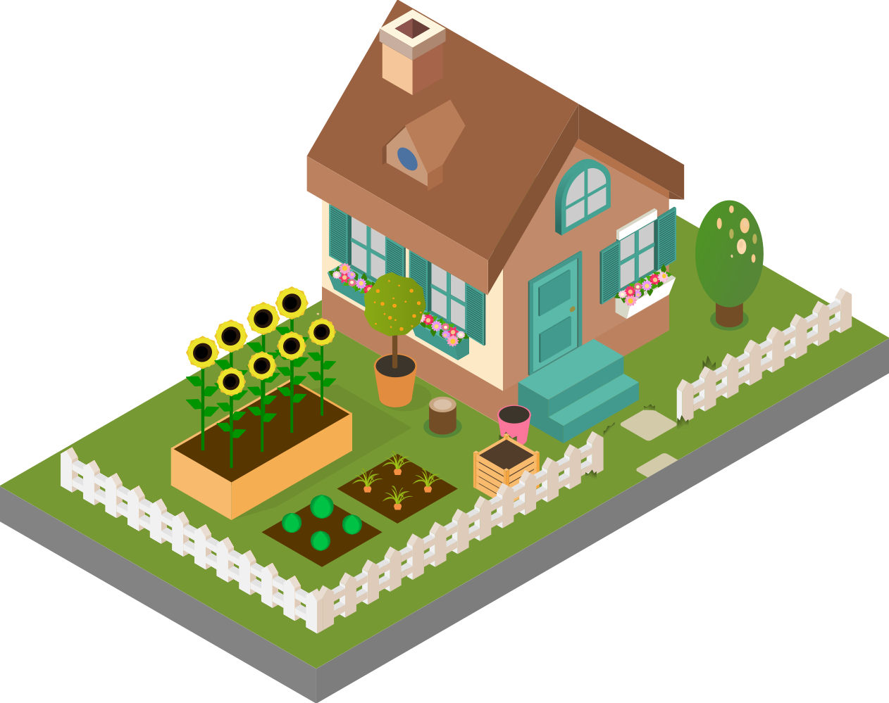
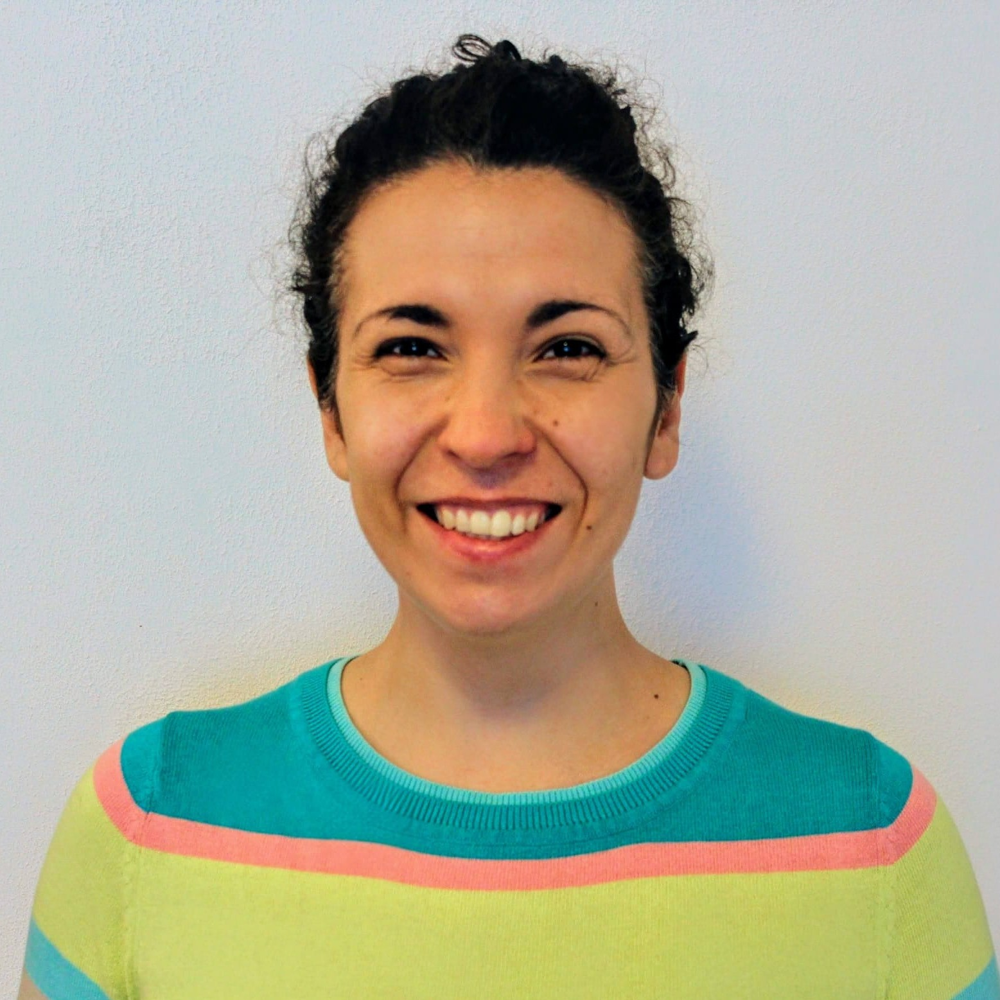

::: {.page-icon}

:::

## About me

```{=html}
<div class="about-me" style="display:flex; align-items:center; gap:2rem;">
  
  <div class="about-me-text">
    <ul>
      <li><strong>Scientist</strong></li>
      <li>Enjoy designing and leading <strong>workshops</strong></li>
      <li>Love connecting research <strong>ideas</strong> with everyday challenges</li>
      <li>Obsessed with <strong>note-taking apps</strong></li>
      <li>Always curious, always <strong>learning something new</strong></li>
</ul>
  </div>
</div>
```
<br>

My work exists at the intersection of research, technical infrastructure, and community leadership.

[My current work](shrews.qmd) centers on the cognitive compromises of the common shrew, a model species for studying brain size plasticity and behavior.

I lead community initiatives that transform Open Science from a policy requirement into a practical workflow. This involves building the technical systems and professional networks necessary for digital collaboration. I love **facilitating workshops** and I focus on making **complex ideas accessible** and **connecting people** across fields. You can see examples of this in my [Talks & Workshops](talks.qmd) and [Projects](project.qmd) pages.

Practicing [Open Science](open-science.qmd) is both a technical choice and a cultural one. I am committed to advancing transparency and reproducibility, ensuring data is not just "available" but actually usable.

Communities I'm part of:

- [SORTEE](https://sortee.org/) — Code Club and Community Management
- [R-Ladies Global](https://rladies.org/) — contributing to the blog
- [The Turing Way](https://book.the-turing-way.org/) — community management working group
- [PCI Ecology](https://ecology.peercommunityin.org/) — code editor
- [The Carpentries](https://carpentries.org/) - Instructor and member of the Code of Conduct Committee


I’m always curious about new ways to connect people and ideas.

If you want to collaborate, share ideas, or just have a friendly chat, feel free to [reach out](contact.qmd) or book some time to talk.
