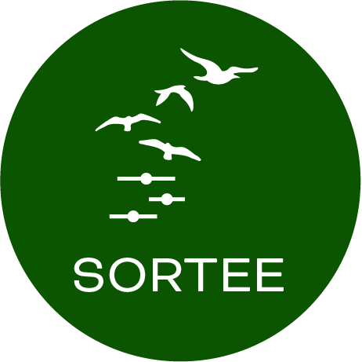
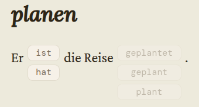
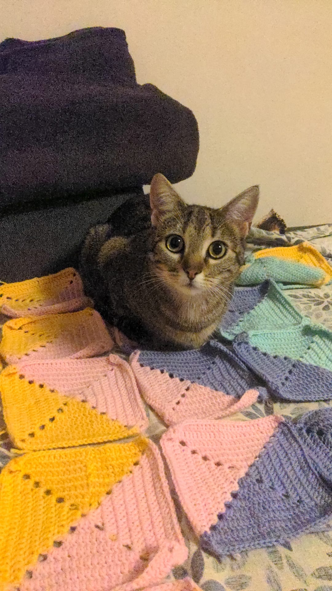

## Games

```{=html}
<div class="game-container">
  <div class="game-card">
    
    
    <div class="card-content">
      <h3>Open Science Bingo</h3>
      <p>My first game ever, an Open Science Bingo Game! I created it for the SORTEE Code Club session in December 2025</p>
      
      <div class="card-actions">
        <a href="https://github.com/cecibaldoni/open-science-bingo" class="btn">GitHub Repo</a>
        <a href="https://cecibaldoni.github.io/open-science-bingo/" class="btn">Play!</a>
      </div>
    </div>
  </div>
  
  <div class="game-card">
    
    
    <div class="card-content">
      <h3>German Article Trainer</h3>
      <p>Instead of relying on my notebook, I made a game so I can practice articles on the go!</p>
      
      <div class="card-actions">
        <a href="https://github.com/cecibaldoni/der-die-das" class="btn">GitHub Repo</a>
        <a href="https://cecibaldoni.github.io/der-die-das/" class="btn">Play!</a>
      </div>
    </div>
  </div>
  
    <div class="game-card">
    
    
    <div class="card-content">
      <h3>German Perfekt Verben</h3>
      <p>Practice the impossible world of Perfekt verbs!</p>
      
      <div class="card-actions">
        <a href="https://github.com/cecibaldoni/perfekt-verben" class="btn">GitHub Repo</a>
        <a href="https://cecibaldoni.github.io/perfekt-verben/" class="btn">Play!</a>
      </div>
    </div>
  </div>

</div>
```

## Tools and Apps

```{=html}
<div class="game-container">
  <div class="other-card">
    
    
    <div class="card-content">
      <h3>Granny Square Generator</h3>
      <p>Fun and simple tool to calculate and visualise the best pattern for a granny square blanket.</p>
      
      <div class="card-actions">
        <a href="https://github.com/cecibaldoni/granny-square-blanket/tree/main" class="btn">GitHub Repo</a>
        
      </div>
    </div>
  </div>
</div>
```