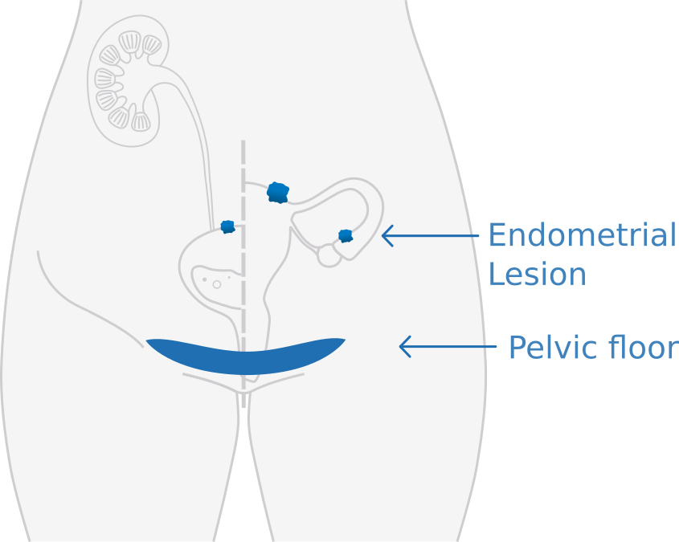
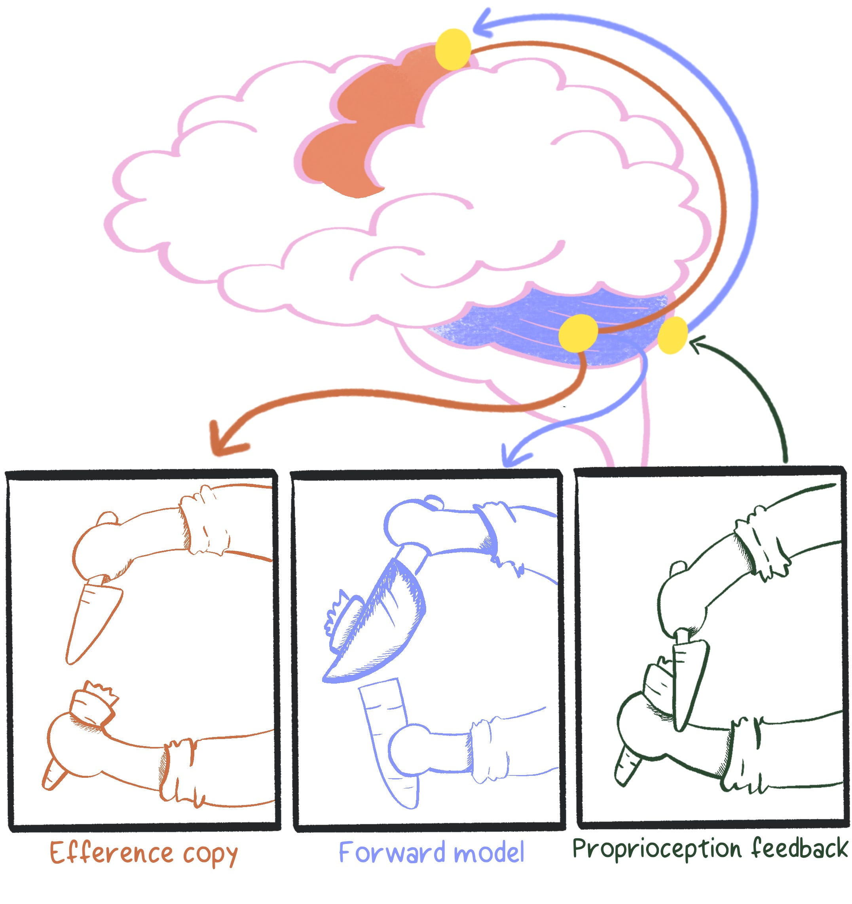
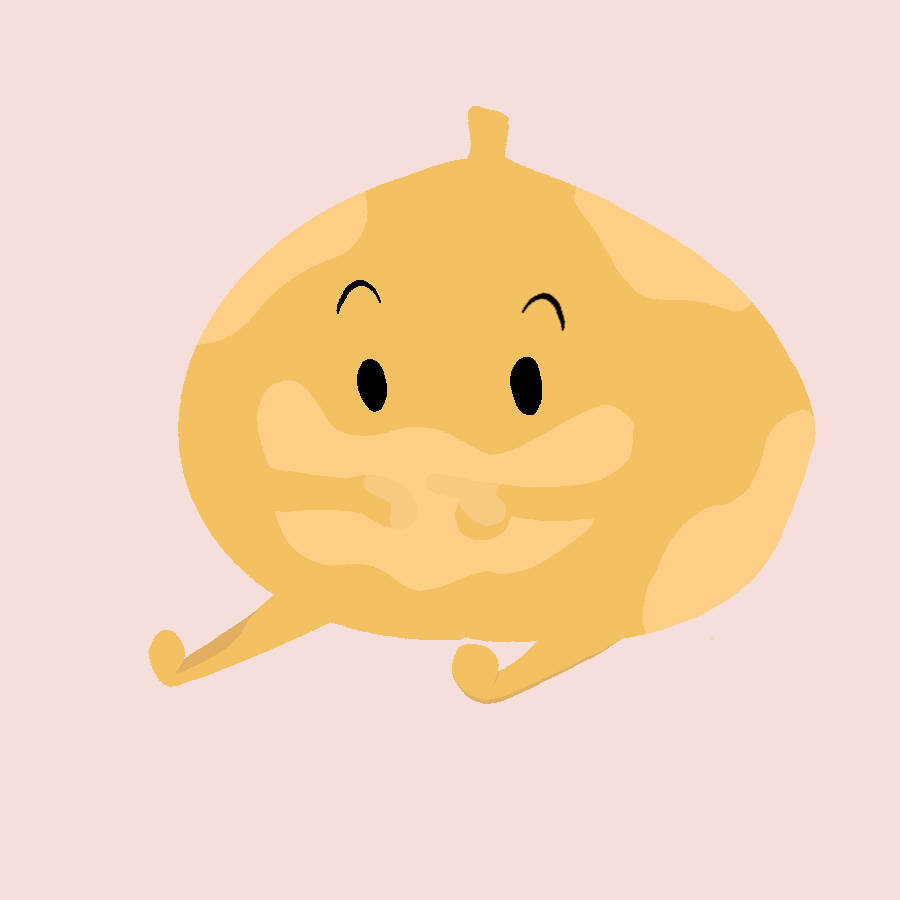
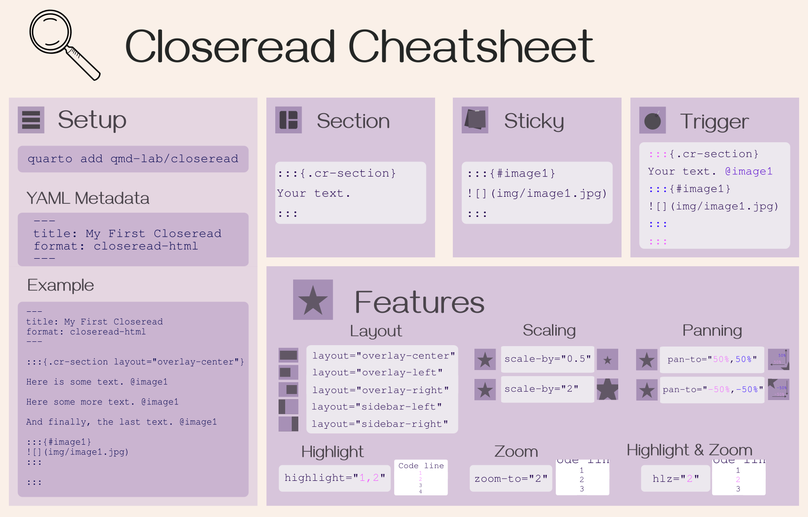
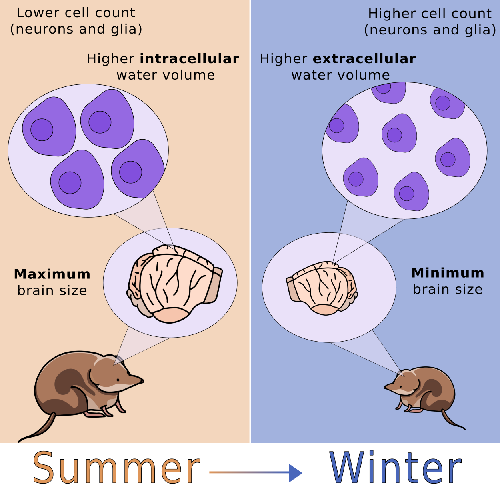

```{=html}
<div class="pf-hero">
  <div class="pf-name">Cecilia Baldoni</div>
  <p class="pf-tagline">I write about science, and I illustrate it.</p>
</div>
```

```{=html}
<div class="pf-bio">
```

I am a **writer** and **illustrator** with a PhD in Natural Science. 
I specialised on neuroscience, physics, animal ecology, and cognition, and I published and co-published 10+ peer-reviewed papers. I publish a [science communication newsletter](https://chickpeasprouts.substack.com/) where I expanded my writing to medicine, psychology, and everything related to life science. For fun, I write [personal essays](https://cecibaldoni.github.io/blog/) about meta-research, note-taking and productivity, plus the resources I build along the way. 

I'm a certified Carpentries instructor and a recurring conference and workshop speaker on open science and data skills. I love communicating science and data into multi-format content.

Scroll down to look at a curation of signature pieces!

```{=html}
</div>
```

```{=html}
<h2 style="text-align: center;">Services</h2>
<div class="pf-services">
  <div class="pf-service">
    <h3>Writing</h3>
    <ul>
      <li>Science communication for general audiences</li>
      <li>Technical or editorial writing for medical content</li>
      <li>Digital content: newsletter, blog posts, essays</li>
    </ul>
  </div>
  <div class="pf-service">
    <h3>Illustration</h3>
    <ul>
      <li>Scientific figures and graphical abstracts</li>
      <li>Icons, diagrams, and visual systems for talks, workshops, and websites</li>
      <li>Thumbnails and illustrations</li>
    </ul>
  </div>
</div>
```

## From the notebook

:::{.cr-section layout="overlay-left"}

<span class="pf-tab"> Medical writing</span> @cr-page-mts

<span class="pf-tab"> Science storytelling</span> @cr-page-substack

<span class="pf-tab"> Personal Essay</span> @cr-page-essay

<span class="pf-tab"> Process writing</span> @cr-page-blog

<span class="pf-tab"> Peer-reviewed + illustration</span> @cr-page-cb

:::{#cr-page-mts}
```{=html}
<div class="pf-notebook-wrap">
<div class="pf-notebook">
  <div class="pf-page pf-page-left pf-mid-shadow">
  <div class="pf-eyebrow">Medical writing</div>
    
    
    <h4>Chronic Pelvic Pain in Women: Shockwave Therapy Data</h4>
    <div class="pf-meta">MTS Medical Blog · Sep 2026</div>
  </div>
  <div class="pf-page pf-page-right pf-mid-shadow">
    <p class="pf-excerpt">“Chronic Pelvic Pain Syndrome (CPPS) is one of the most common presentations within the Female Sexual Dysfunction spectrum. It is defined as persistent pelvic discomfort or pain that lasts over six months, in the absence of identifiable infection or other obvious local pathology. Although this syndrome is shared by urology and gynecology, with parallel diagnostic criteria and many of the same mechanistic drivers, chronic pelvic pain is more common in women.
Chronic pelvic pain often comes along with, or drives, sexual dysfunction, and persistent pelvic discomfort is strongly associated with secondary reductions in desire. The two conditions sustain each other in a well-characterised cycle: pain disrupts sexual function, which in turn compounds distress, which sensitises pain perception further.
Current treatments are predominantly oriented towards symptom management. [...] When conservative treatment does not bring relief, surgery is considered a last resort. No single intervention reliably resolves the condition.
”</p>
    <a class="pf-link" href="" target="_blank">Continue reading ↗</a>
  </div>
  <div class="pf-pen"></div>
</div>
</div>
```
:::

:::{#cr-page-substack}
```{=html}
<div class="pf-notebook-wrap">
<div class="pf-notebook">
  <div class="pf-page pf-page-left pf-mid-shadow">
  <div class="pf-eyebrow">Science storytelling</div>
    
    
    <h4>The Science Behind Clumsiness</h4>
    <div class="pf-meta">Chickpea Sprouts · Substack · Jan 2026</div>
  </div>
  <div class="pf-page pf-page-right pf-mid-shadow">
    <p class="pf-excerpt">“Two Sunday ago, with my husband away for the evening, I was left to the high-stakes task of fetching dinner for myself. So I moved to the kitchen with the casual confidence of someone who has managed to survive into their thirties without major structural damage. I would love to say that what happened next was a rare occurrence. I would love to tell you that this type of silly incident involving a sharp utensil and one of my blameless fingers never happens to me. But the collection of faint scars across my hands and knees (and, who am I kidding, everywhere else) begs to differ. My body is a historical record of every time I underestimated the distance between myself and something else (often an hard surface, sometimes a pointy knife).”</p>
    <a class="pf-link" href="https://chickpeasprouts.substack.com/p/the-science-behind-clumsiness" target="_blank">Continue reading ↗</a>
  </div>
  <div class="pf-pen"></div>
</div>
</div>
```
:::

:::{#cr-page-essay}
```{=html}
<div class="pf-notebook-wrap">
<div class="pf-notebook">
  <div class="pf-page pf-page-left pf-mid-shadow">
  <div class="pf-eyebrow">Personal Essay</div>
    

    <h4>My mom has vitiligo</h4>
    <div class="pf-meta">Chickpea Sprouts · Substack</div>
  </div>
  <div class="pf-page pf-page-right pf-mid-shadow">
    <p class="pf-excerpt">“In Italy in the eighties, you were supposed to tan. It was proof you’d done summer correctly, or that you lived outside. My mom’s skin had other plans, and it was slowly moving in the opposite direction. Both my parents have (had?) classic tanning Mediterranean complexion: high baseline melanin that comes with olive skin.
Which sounds fancy until winter arrives and you turn the color of a zombie. Seriously. Grey-green undertones. It’s supposed to be scary but it’s actually sad. Tanning in summer for me (and for them) means looking alive in winter.
Actually, that zombie effect only happens if you have enough melanin to fade in the first place. If you have none at all, the problem doesn’t exist. That’s exactly what happened to my mom.”</p>
    <a class="pf-link" href="https://chickpeasprouts.substack.com/p/my-mom-has-vitiligo" target="_blank">Continue reading ↗</a>
  </div>
  <div class="pf-pen"></div>
</div>
</div>
```
:::

:::{#cr-page-blog}
```{=html}
<div class="pf-notebook-wrap">
<div class="pf-notebook">
  <div class="pf-page pf-page-left pf-mid-shadow">
    <div class="pf-tape tl"></div>
    <div class="pf-tape tr"></div>
    <div class="pf-eyebrow">Process writing</div>
    
    
    <h4>A Cheatsheet for Closeread</h4>
    <div class="pf-meta">Personal Blog · Mar 2025</div>
  </div>
  <div class="pf-page pf-page-right pf-mid-shadow">
    
    <p class="pf-excerpt">“So, I got invited to give a talk for R-Ladies Amsterdam. About something I really, really like: scrollytelling with Quarto and Closeread.”</p>
    <a class="pf-link" href="../blog/closeread-cheatsheet.qmd" target="_blank">Continue reading ↗</a>
  </div>
  <div class="pf-pen"></div>
</div>
</div>
```
:::

:::{#cr-page-cb}
```{=html}
<div class="pf-notebook-wrap">
<div class="pf-notebook">
  <div class="pf-page pf-page-left pf-mid-shadow">
    <div class="pf-tape tl"></div>
    <div class="pf-tape tr"></div>
    <div class="pf-eyebrow">Peer-reviewed + illustration</div>
    
    <h4>Programmed seasonal brain shrinkage in the common shrew via water loss without cell death</h4>
    <div class="pf-meta">Current Biology · 2025</div>
  </div>
  <div class="pf-page pf-page-right pf-mid-shadow">
    <p class="pf-excerpt">Brain plasticity, the brain’s inherent ability to adapt its structure and function, is crucial for responding to environmental challenges but is usually not linked to a significant change in size. A striking exception to this is Dehnel’s phenomenon, where seasonal reversible brain-size reduction occurs in some small mammals to decrease metabolic demands during resource-scarce winter months. Despite these volumetric changes being well documented, the specific microstructural alterations that facilitate this adaptation remain poorly understood. Our study employed diffusion microstructure imaging (DMI) to explore these changes in common shrews, revealing significant alterations in water diffusion properties such as increased mean diffusivity and decreased fractional anisotropy, leading to decreased water content inside brain cells during winter. These findings [...] may inform future research on regenerative mechanisms, particularly during the spring regrowth phase, offering potential strategies relevant to neurodegenerative disease.
</p>
    <a class="pf-link" href="https://www.cell.com/current-biology/fulltext/S0960-9822(25)01081-4" target="_blank">Read the paper ↗</a>
  </div>
  <div class="pf-pen"></div>
</div>
</div>
```
:::


:::

```{=html}
<div class="pf-superpower">
```

Science doesn't have to be complicated. <br><br> Most of my days are spent inside journal articles thick with jargon, the kind that makes a genuinely curious reader bounce off by the second paragraph. <br><br> My superpower is going in after that language and handing the finding back over intact, in words that survive outside the lab.

```{=html}
</div>
```

```{=html}
<div class="pf-cta">
  <h2 style="text-align: center;">Let's work together!</h2>
  
  <div class="pf-cta-row">
    <a class="pf-btn pf-btn-primary" href="https://cecibaldoni.github.io/content/contact.html">Get in touch</a>
    <a class="pf-btn pf-btn-secondary" href="../data/resume-Baldoni.pdf" target="_blank">Download Resume</a>
  </div>
  <div class="pf-cta-row-secondary">
    <a class="pf-btn pf-btn-tertiary" href="https://cecibaldoni.github.io/">Back to main site</a>
  </div>
</div>
```
