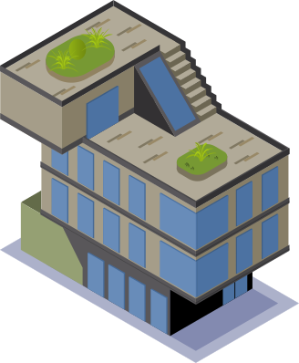
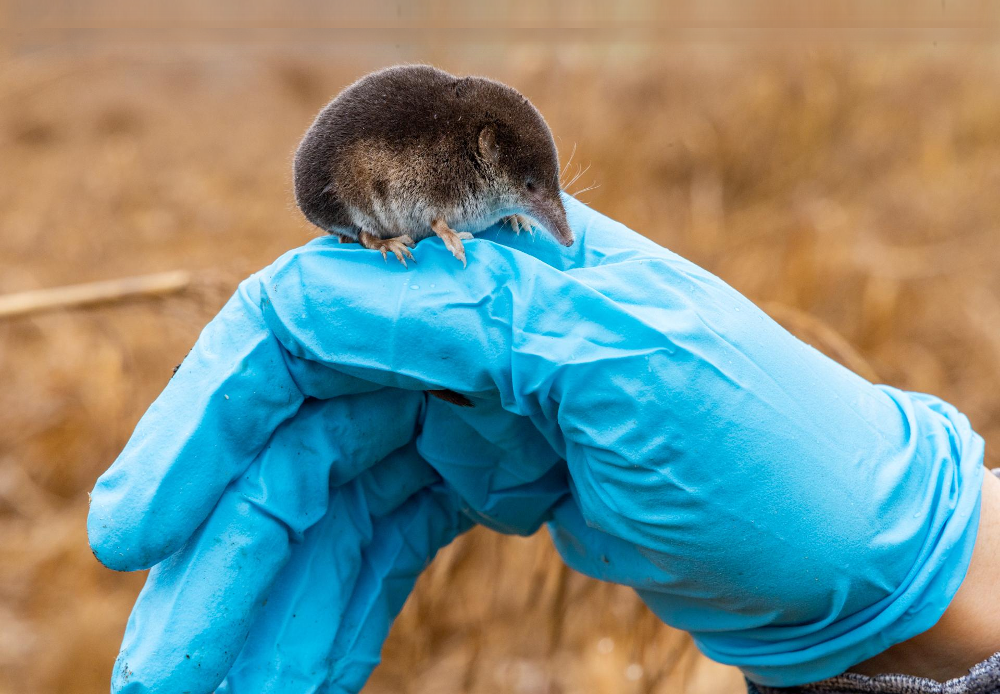
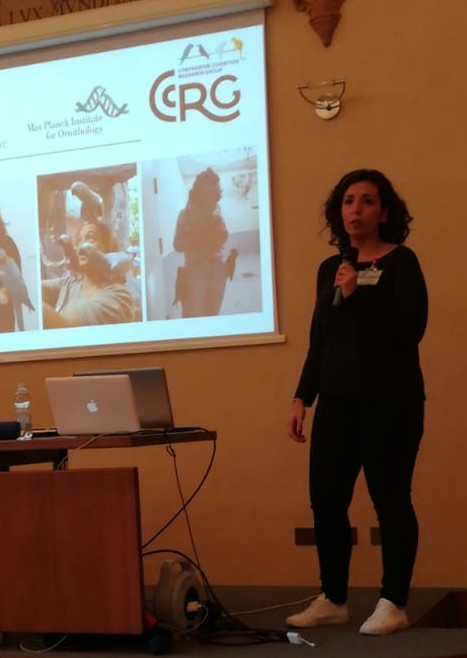
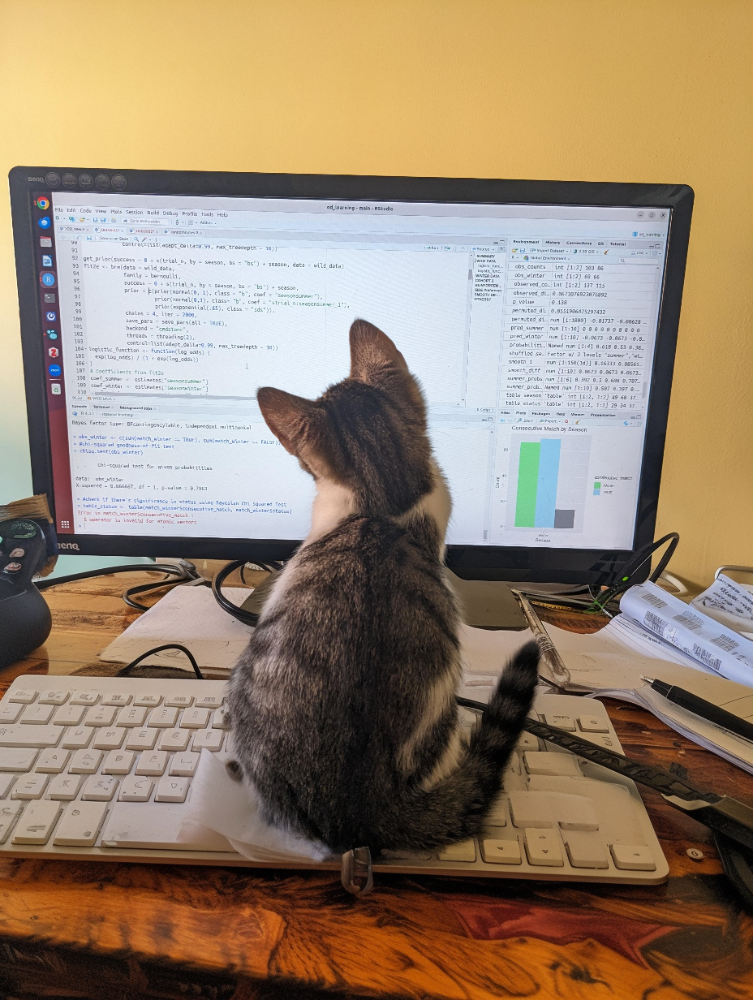
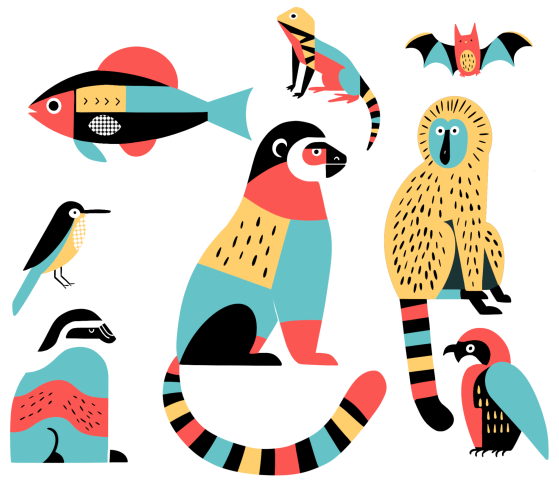
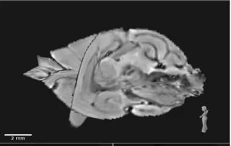

::: {.page-icon}

:::

## Projects {#current-research}

```{=html}
<div class="research-gallery">

<div class="project-card">
  <a href="shrews.qmd">
    
    <h3>Shrews</h3>
    <p>Seasonal brain plasticity, cognition, shrews... explored through data and visual storytelling.</p>
  </a>
</div>

<div class="project-card">
  <a href="talks.qmd">
    
    <h3>Workshops & Talks</h3>
    <p>Conferences, seminars, and hands-on workshops on open workflows and data science.</p>
  </a>
</div>

<div class="project-card">
  <a href="open-science.qmd">
    
    <h3>Open Science</h3>
    <p>Personal and community efforts to improve transparency and reproducibility in science.</p>
  </a>
</div>

<div class="project-card">
  <a href="games.qmd">
    
    <h3>Code & Games</h3>
    <p>Fun stuff I built, mostly with Quarto (and SCSS because why not)</p>
  </a>
</div>

<div class="project-card">
  <a href="illustrations.qmd">
    
    <h3>Illustrations</h3>
    <p>Science-inspired art and illustrations.</p>
  </a>
</div>

<div class="project-card">
  <a href="publications.qmd">
    
    <h3>Publications</h3>
    <p>My academic (and not) publications.</p>
  </a>
</div>

</div>
```