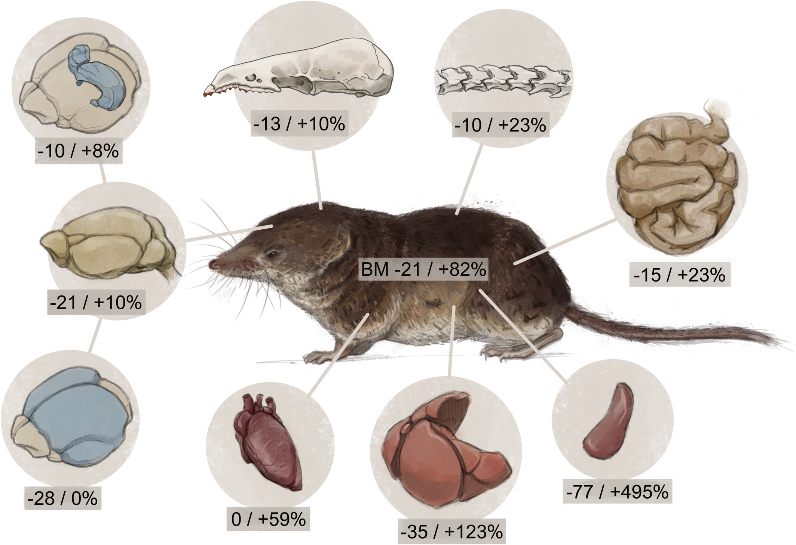
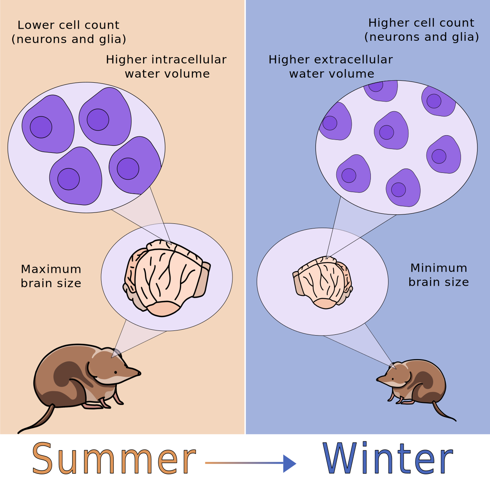
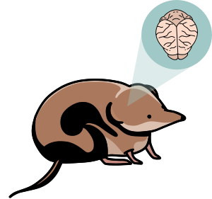
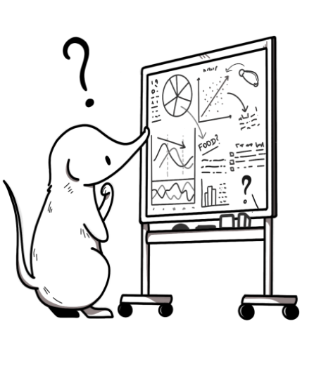
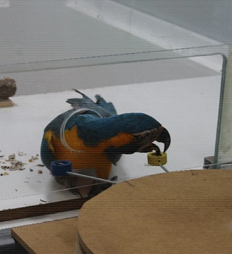
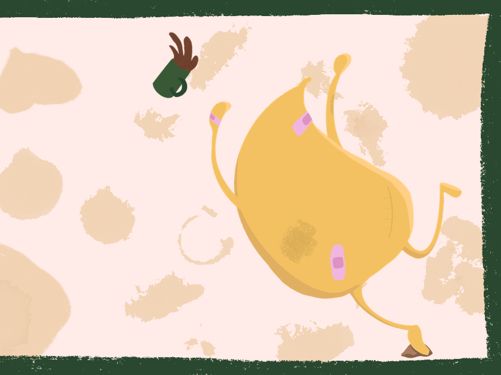
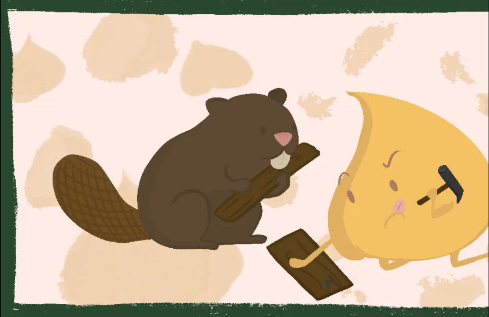
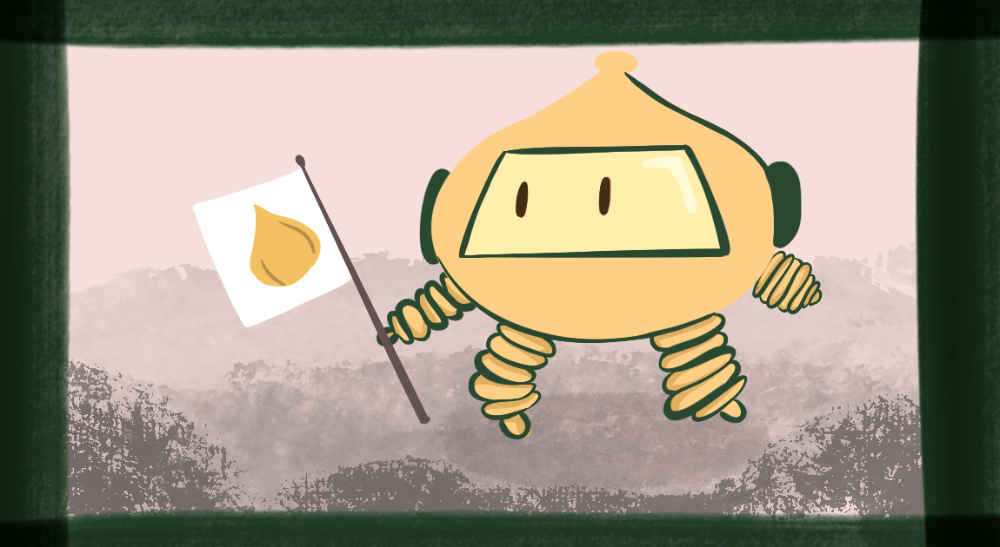

::: {.page-icon}

:::

## Selected peer-reviewed publications

```{=html}
<div class="listing-item">
  <div class="thumbnail">
    
  </div>
  <div>
    <p><strong><a href="https://onlinelibrary.wiley.com/doi/full/10.1111/mam.70032">
      Dehnel's Phenomenon in Mammals (2026)
    </a></strong></p>
    <p>Dehnel's phenomenon is fascinating, but poorly understood. In this review we investigate the status and future directions of research! <br><br><i>Illustration by  <a href="https://www.lazaroillustration.com/">Javier Lázaro</a></i></p>
  </div>
</div>

<div class="listing-item">
  <div class="thumbnail">
    
  </div>
  <div>
    <p><strong><a href="https://www.sciencedirect.com/science/article/pii/S0960982225010814">
      Programmed seasonal brain shrinkage in the common shrew via water loss without cell death (2025)
    </a></strong></p>
    <p><i>In vivo</i> MRI has revealed that common shrews shrink their brains for winter survival by safely and reversibly losing water from their brain cells! </p>
  </div>
</div>

<div class="listing-item">
  <div class="thumbnail">
    
  </div>
  <div>
    <p><strong><a href="https://royalsocietypublishing.org/doi/full/10.1098/rsos.242138">
      Captivity alters behaviour but not seasonal brain size change in semi-naturally housed shrews (2025)
    </a></strong></p>
    <p>Captive shrews still shrink their brains seasonally... but their behavior tells a different story! </p>
  </div>
</div>

<div class="listing-item">
  <div class="thumbnail">
    
  </div>
  <div>
    <p><strong><a href="https://kops.uni-konstanz.de/server/api/core/bitstreams/e0d74103-3884-47b1-b828-b86219cca825/content">
      From summer growth to winter decline: brain size, captive effect & cognitive outcomes in common shrew during Dehnel’s phenomenon (2024)
    </a></strong></p>
    <p>In my dissertation, I explore how seasonal brain plasticity affects learning and physiology in the common shrew!</p>
  </div>
</div>

<div class="listing-item">
  <div class="thumbnail">
    
  </div>
  <div>
    <p><strong><a href="https://www.frontiersin.org/journals/neuroanatomy/articles/10.3389/fnana.2023.1168523/full">
      Histological and MRI brain atlas of the common shrew, <em>Sorex araneus</em>, with brain region-specific gene expression profiles (2023)
    </a></strong></p>
    <p>The common shrew is one of the few mammals that shrinks and regrows its brain... and now it has its own detailed brain atlas!</p>
  </div>
</div>

<div class="listing-item">
  <div class="thumbnail">
    
  </div>
  <div>
    <p><strong><a href="https://link.springer.com/article/10.1007/s10071-021-01565-6">
      Intra‑ and interspecific variation in self‑control capacities of parrots in a delay of gratification task (2022)
    </a></strong></p>
    <p>This study compared self‑control across four parrot species using a delay of gratification task.</p>
  </div>
</div>
```

## Science Communication

```{=html}
<div class="listing-item">
  <div class="thumbnail">
    
  </div>
  <div>
    <p><strong><a href="https://chickpeasprouts.substack.com/p/the-science-behind-clumsiness">
      The Science behind Clumsiness
    </a></strong></p>
    <p>How a snowy trip to the ER made me wonder about brains.</p>
  </div>
</div>

<div class="listing-item">
  <div class="thumbnail">
    
  </div>
  <div>
    <p><strong><a href="https://chickpeasprouts.substack.com/p/a-beaver-post">
      A Beaver Post
    </a></strong></p>
    <p>The mandatory beaver post that my brain was asking about</p>
  </div>
</div>

<div class="listing-item">
  <div class="thumbnail">
    
  </div>
  <div>
    <p><strong><a href="https://chickpeasprouts.substack.com/p/it-was-always-going-to-be-the-chickpea">
      It was always going to be the chickpea
    </a></strong></p>
    <p>It's about moon chickpeas.</p>
  </div>
</div>
```

