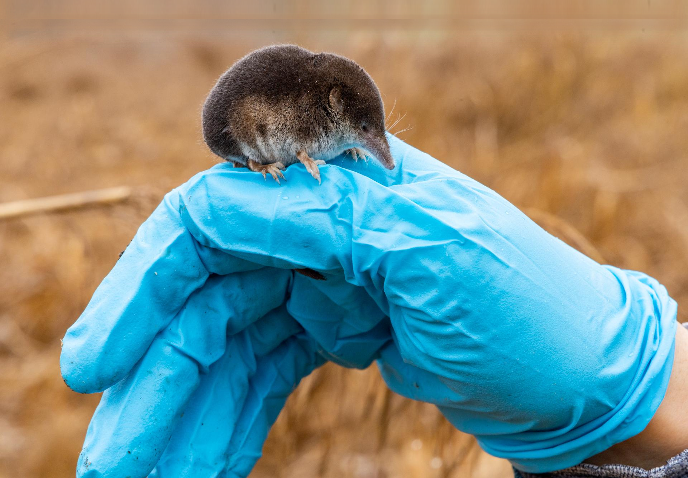
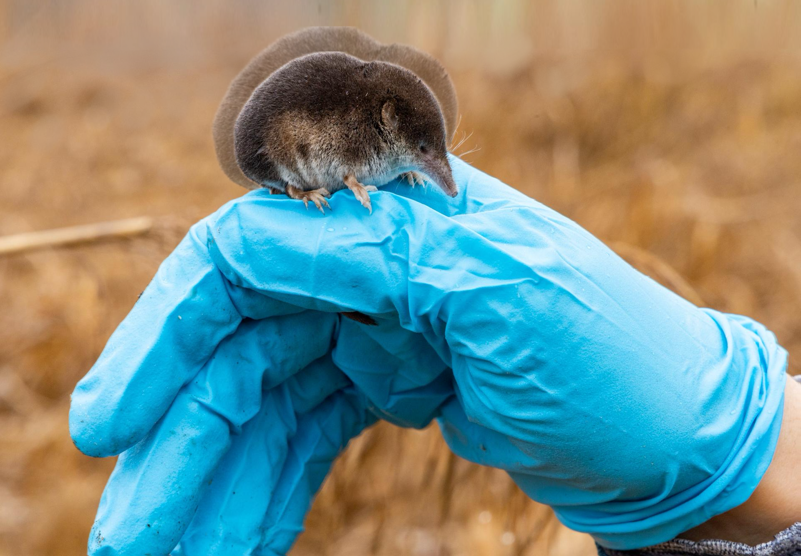
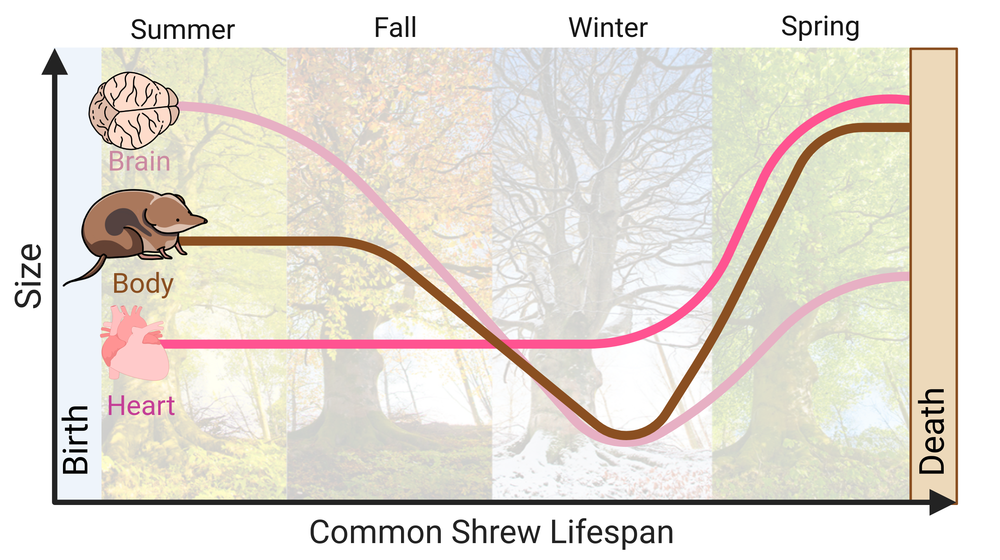
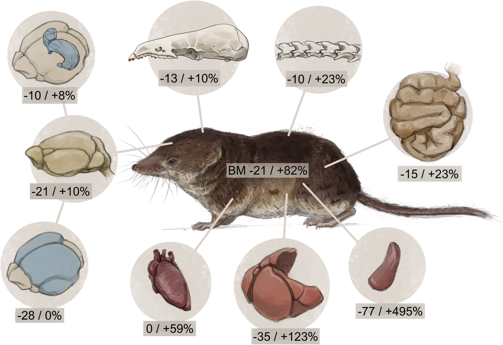
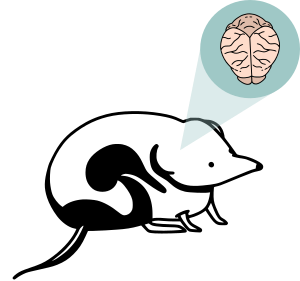
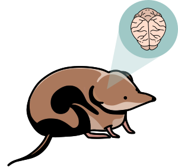
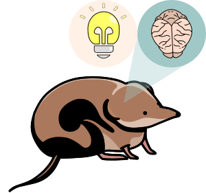
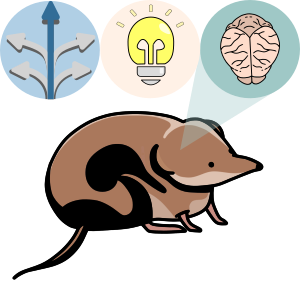
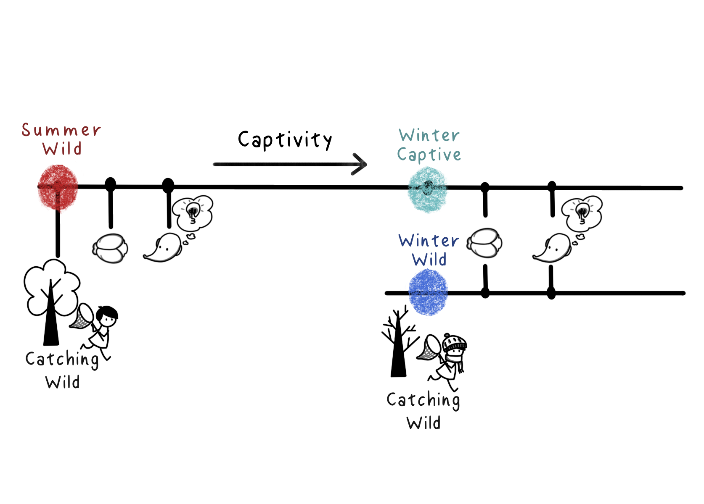

# The Shrew Toolkit {#shrew}

You don't need any background in biology to read this. It's a scroll-through introduction to the animal I study, one idea at a time: the story is on one side, and the picture changes as you scroll past it. Where you see a dotted underline, hover or tap it for a plain-language definition. Where you see a **+**, click it to open something extra.

1. [What is a shrew, anyway?](#p1)
2. [The problem with being tiny](#p2)
3. [Dehnel's Phenomenon: the shrinking-brain trick](#p3)
4. [Why brain size affects behavior](#p4)
5. [Wild vs. captive: does environment change learning?](#p5)
6. [Toolkit: how do you even study something this small?](#p6)
7. [Glossary](#glossary)

## Part 1 · What is a shrew, anyway? {#p1}

A shrew is a small mammal that looks a bit like a mouse but isn't. Shrews belong to their own group (*Eulipotyphla*) alongside moles and hedgehogs. Among those there is the common shrew, *Sorex araneus*: body about 6-8cm long, weighing 5-14 grams depending on the season (more on that below). It eats mostly insects and worms, lives across most of Europe, and it's almost blind (unlike the mouse you might be picturing), and finds its way around by smell, touch, and near-constant high-pitched ~~complaining~~ squeaking.

```{=html}
<div class="size-scale">
  <div class="sz-item sz-coin">
    <div class="sz-shape"></div>
    <div class="sz-label">Coin<br><small>~2.5cm</small></div>
  </div>
  <div class="sz-item sz-shrew">
    <div class="sz-shape"></div>
    <div class="sz-label">Common shrew<br><small>~6-8cm body</small></div>
  </div>
  <div class="sz-item sz-mouse">
    <div class="sz-shape"></div>
    <div class="sz-label">House mouse<br><small>~8-10cm body</small></div>
  </div>
  <div class="sz-item sz-pencil">
    <div class="sz-shape"></div>
    <div class="sz-label">Pencil<br><small>~19cm</small></div>
  </div>
</div>
```

Being that small comes at a cost. A tiny body loses heat fast and can only carry a tiny fuel tank, so it has to burn energy at a punishing rate just to stay warm and alive, meaning that its <span class="term" tabindex="0">metabolism<span class="term-tip">How fast an animal's body burns energy just to keep itself running. A shrew's is one of the highest of any mammal.</span></span> is one of the most extreme of any mammal. A shrew that goes a few hours without eating can starve to death.

```{=html}
<details class="reveal">
<summary>So how does a shrew survive a whole winter, when insects are scarce and every hour without food is dangerous? Guess before you scroll on.</summary>
<div class="reveal-body">
It shrinks. Not metaphorically — its brain, skull, and several organs physically shrink by autumn, then regrow the following spring. That real, reversible transformation is called <strong>Dehnel's Phenomenon</strong>, and it's the subject of the rest of this page.
</div>
</details>
```

## Part 2 · The problem with being tiny {#p2}

:::{.cr-section layout="overlay-center"}

The common shrew (*Sorex araneus*) is a tiny mammal with a <span class="term" tabindex="0">metabolism<span class="term-tip">How fast an animal's body burns energy just to keep itself running.</span></span> so *extreme* that even a few hours without food can be fatal. @cr-shrew

This high metabolism makes them particularly vulnerable to seasonal changes, and it makes it **impossible for them to <span class="term" tabindex="0">hibernate<span class="term-tip">Slow the body down and sleep through the cold months, living off stored fat. A shrew burns fuel too fast to bank enough fat to do this.</span></span> during winter**. Their solution? They **shrink**.

Unlike animals that grow steadily over years, shrews undergo a radical transformation within a single lifetime. @cr-shrew-overlay

This dramatic change, **Dehnel's Phenomenon**, reduces their brain, bones, and organs to save energy in winter scarcity, regrowing them in spring for breeding.

:::{#cr-shrew}
{alt="Close-up of a shrew"}
:::

:::{#cr-shrew-overlay}
{alt="Close-up of a shrew"}
:::

:::

:::{.cr-section layout="sidebar-right"}

How does it work? @cr-shrew-cycle

Born in **summer**, shrews rapidly reach peak brain size. This is the largest their brains will ever be.  [@cr-shrew-cycle]{pan-to="50%,-20%" scale-by="1.8"}

As **winter** sets in, the shrew shrinks their brains and bodies, reducing energy needs. [@cr-shrew-cycle]{pan-to="-10%,-20%" scale-by="2"}

By **spring**, they double their winter mass, gearing up to reproduce. [@cr-shrew-cycle]{pan-to="-50%,-5%" scale-by="1.7"}

Shrews **live only about a year**, so this transformation happens just once.  @cr-shrew-cycle

:::{#cr-shrew-cycle}
{alt="Shrew Cycle"}
:::

:::

## Part 3 · Dehnel's Phenomenon: the shrinking-brain trick {#p3}

:::{.cr-section layout="sidebar-right"}

It isn't only the brain. Brain, body, and heart all follow the same summer-to-spring curve, just by different amounts. @cr-shrew-lifespan

The **brain** (light pink) shrinks the earliest and the most dramatically, then is the last to recover in spring. The **body** (brown) follows a similar dip. The **heart** (pink) barely shrinks at all — a shrew's heart has to keep working hard all winter, regardless of size. @cr-shrew-lifespan

:::{#cr-shrew-lifespan}
{alt="Brain, body, and heart size across a shrew's lifespan, from summer through winter to spring"}
:::

:::

```{=html}
<details class="reveal">
<summary>Curious how much each organ actually shrinks and regrows? Open the full breakdown.</summary>
<div class="reveal-body">
<p>This isn't unique to the brain: nearly every organ shrinks in autumn and overshoots its original size by spring. The numbers below show percent change (autumn shrinkage / spring regrowth) for each one.</p>

</div>
</details>
```

## Part 4 · Why brain size affects behavior {#p4}

:::{.cr-section layout="sidebar-right"}

What happens *cognitively* when brains shrink and regrow? @cr-shrew-cognitionbw

My research explores what happens when their brain changes size: @cr-shrew-cognition

How does brain size affect <span class="term" tabindex="0">cognitive<span class="term-tip">Cognition covers the mental skills an animal uses to sense its surroundings, learn, remember, and make decisions.</span></span> abilities? @cr-shrew-lightbulb

Does a smaller brain lead to simpler decision-making? @cr-shrew-decisionmaking

These questions go *beyond just shrews*. Understanding how an animal maintains function despite physical changes in the brain helps us explore broader ideas in <span class="term" tabindex="0">neurodegeneration<span class="term-tip">The loss of brain cells or brain function over time — as happens in conditions like Alzheimer's or Parkinson's disease.</span></span> and energy efficiency.

:::{#cr-shrew-cognitionbw}
{alt="Shrew cognition" width="70%"}

:::

:::{#cr-shrew-cognition}
{alt="Shrew cognition" width="70%"}
:::

:::{#cr-shrew-lightbulb}
{alt="Shrew cognition" width="70%"}
:::

:::{#cr-shrew-decisionmaking}
{alt="Shrew cognition" width="70%"}
:::

:::

## Part 5 · Wild vs. captive: does environment change learning? {#p5}

```{r}
#| echo: false
#| fig-asp: 1.2
#| message: false
library(ggplot2)
library(tidyverse)
raw_data <- readRDS("../data/al_data.rds")
model_data <- readRDS("../data/al_fitted.rds")
```


:::{.cr-section layout="sidebar-right"}

Brain size is of course only part of the story... environment shapes behavior too. @cr-captive-shrew

In *captivity*, animals face new challenges.  Do shrews kept in captivity learn differently than those in the wild? @cr-captive-shrew

I tested the ability of shrews to associate an odor cue with a reward in a <span class="term" tabindex="0">Y-maze<span class="term-tip">A Y-shaped apparatus with two arms an animal can choose between. One arm is paired with a cue that predicts a reward.</span></span> <span class="term" tabindex="0">associative learning<span class="term-tip">Learning that one thing (a smell) reliably predicts another (a reward) — one of the simplest forms of learning to measure.</span></span> task. @cr-shrew-empty-plot

Each **dot** represents an individual shrew's decision in a trial.  The **x-axis** represents the trial number, from 1 to 10. The **y-axis** shows whether they made the correct choice (**1**) or the wrong one (**0**). @cr-shrew-empty-plot

**Summer wild (orange)** shrews had the highest and earliest success rates. @cr-shrew-summer-plot

**Winter wild (dark blue)** shrews showed a similar learning curve, but they learned at a slower rate and did not reach the **Summer** success rate. @cr-shrew-wild-plot

**Winter captive (light blue)** shrews showed no learning, never deviating from chance. @cr-shrew-complete-plot

📄 This work is published in *Royal Society Open Science*: [*Captivity alters behaviour but not seasonal brain size change in semi-naturally housed shrews*](https://royalsocietypublishing.org/doi/10.1098/rsos.242138)

:::{#cr-captive-shrew}
{alt="Shrew cognition"}
:::

:::{#cr-shrew-empty-plot}
```{r out.width="100%"}
ggplot(raw_data, aes(x = trial, y = success, color = category)) +
  geom_jitter(width =  0.05, height = 0.05) +
  labs(x = "Trial", y = "Success rate") +
  labs(color="Status", fill="CI 95%") +
  scale_color_manual(values = c("#D16103","#0AA9A9", "#0A33A9"), labels = c("Summer Wild","Winter Captive", "Winter Wild")) +
  theme_bw() +
  theme(legend.position = "none",
        axis.title.x = element_text(size=15, vjust=0),
        axis.title.y = element_text(size=15, vjust=0),
        axis.text.x = element_text(size=12, vjust=0),
        legend.text = element_text(size = 10),
        axis.text.y = element_text(size=12, vjust=0))
```
:::

:::{#cr-shrew-summer-plot}
```{r out.width="100%"}
ggplot(filter(raw_data, category == "summer wild"), aes(x = trial, y = success, color = category)) +
  geom_jitter(width =  0.05, height = 0.05) +
  labs(x = "Trial", y = "Success rate") +
  labs(color="Status", fill="CI 95%") +

  scale_color_manual(values = c("#D16103","#0AA9A9", "#0A33A9"), labels = c("Summer Wild","Winter Captive", "Winter Wild")) +
  scale_fill_manual(values = c("#D16103","#0AA9A9", "#0A33A9"), labels = c("Summer Wild","Winter Captive", "Winter Wild")) +
  scale_x_discrete(breaks = raw_data$trial, labels = raw_data$trial) +
  geom_line(data = filter(model_data, category == "summer wild"), aes(x = trial, y = AvgEstimate, group = category), linewidth = 2) +
  geom_ribbon(data = filter(model_data, category == "summer wild"),
              aes(x = trial, ymin = Lower, ymax = Upper, fill = category, group = category),
              alpha = 0.2, inherit.aes = FALSE) +
  theme_bw() +
  theme(legend.position = "none",
        axis.title.x = element_text(size=15, vjust=0),
        axis.title.y = element_text(size=15, vjust=0),
        axis.text.x = element_text(size=12, vjust=0),
        legend.text = element_text(size = 10),
        axis.text.y = element_text(size=12, vjust=0))
```
:::

:::{#cr-shrew-wild-plot}
```{r out.width="100%"}
ggplot(filter(raw_data, category %in% c("summer wild", "winter wild")), aes(x = trial, y = success, color = category)) +
  geom_jitter(width =  0.05, height = 0.05) +
  labs(x = "Trial", y = "Success rate") +
  labs(color="Status", fill="CI 95%") +

  scale_color_manual(values = c("#D16103", "#0A33A9"), labels = c("Summer Wild", "Winter Wild")) +
  scale_fill_manual(values = c("#D16103", "#0A33A9"), labels = c("Summer Wild", "Winter Wild")) +
  scale_x_discrete(breaks = raw_data$trial, labels = raw_data$trial) +
  geom_line(data = filter(model_data, category %in% c("summer wild", "winter wild")), aes(x = trial, y = AvgEstimate, group = category), linewidth = 2) +
  geom_ribbon(data = filter(model_data, category %in% c("summer wild", "winter wild")),
              aes(x = trial, ymin = Lower, ymax = Upper, fill = category, group = category),
              alpha = 0.2, inherit.aes = FALSE) +
  theme_bw() +
  theme(legend.position = "none",
        axis.title.x = element_text(size=15, vjust=0),
        axis.title.y = element_text(size=15, vjust=0),
        axis.text.x = element_text(size=12, vjust=0),
        legend.text = element_text(size = 10),
        axis.text.y = element_text(size=12, vjust=0))
```
:::

:::{#cr-shrew-complete-plot}
```{r out.width="100%"}
ggplot(raw_data, aes(x = trial, y = success, color = category)) +
  geom_jitter(width =  0.05, height = 0.05) +
  labs(x = "Trial", y = "Success rate") +
  labs(color="Status", fill="CI 95%") +

  scale_color_manual(values = c("#D16103","#0AA9A9", "#0A33A9"), labels = c("Summer Wild","Winter Captive", "Winter Wild")) +
  scale_fill_manual(values = c("#D16103","#0AA9A9", "#0A33A9"), labels = c("Summer Wild","Winter Captive", "Winter Wild")) +
  scale_x_discrete(breaks = raw_data$trial, labels = raw_data$trial) +
  geom_line(data = model_data, aes(x = trial, y = AvgEstimate, group = category), linewidth = 2) +
  geom_ribbon(data = model_data,
              aes(x = trial, ymin = Lower, ymax = Upper, fill = category, group = category),
              alpha = 0.2, inherit.aes = FALSE) +
  theme_bw() +
  theme(legend.position = "none",
        axis.title.x = element_text(size=15, vjust=0),
        axis.title.y = element_text(size=15, vjust=0),
        axis.text.x = element_text(size=12, vjust=0),
        legend.text = element_text(size = 10),
        axis.text.y = element_text(size=12, vjust=0))
```
:::

:::

**Recap: pick a group to see what happened to it.**

```{=html}
<div class="group-toggle">
  <input type="radio" name="cr-grp" id="grp-summer" checked>
  <input type="radio" name="cr-grp" id="grp-wcap">
  <input type="radio" name="cr-grp" id="grp-wwild">
  <div class="group-tabs">
    <label class="tab tab-summer" for="grp-summer">Summer Wild</label>
    <label class="tab tab-wcap" for="grp-wcap">Winter Captive</label>
    <label class="tab tab-wwild" for="grp-wwild">Winter Wild</label>
  </div>
  <div class="group-panel panel-summer">
    <strong>Summer Wild:</strong> caught in summer, brain at its largest, tested in a semi-natural enclosure. Learned the fastest and reached the highest success rate of the three groups.
  </div>
  <div class="group-panel panel-wcap">
    <strong>Winter Captive:</strong> caught in winter, brain already shrunk, tested in a bare captive setup. Showed no learning at all — performance never rose above chance.
  </div>
  <div class="group-panel panel-wwild">
    <strong>Winter Wild:</strong> caught in winter, brain shrunk, but tested in a <span class="term" tabindex="0">semi-natural housing<span class="term-tip">An enclosure built to resemble the animal's real habitat, with soil, cover, and natural foraging opportunities — instead of a bare lab cage.</span></span> setup that resembled their real habitat. Learned more slowly than in summer, but still learned — landing between the other two groups.
  </div>
</div>
```

So brain size alone didn't decide the outcome, the *environment* did too. That's what Part 6 gets into: what these setups actually looked like.

## Part 6 · Toolkit: how do you even study something this small? {#p6}

:::{.cr-section layout="sidebar-left"}

Every result in Part 5 came from a three-stage pipeline, repeated for each of the three groups: catch it, test it, scan it. Here's what that actually looks like. @cr-toolkit-full

**Step 1 is in the field** Shrews are live-trapped in the wild, usually in summer as juveniles, then either released, or moved into the next stage. And yes, that one is me in the field. [@cr-toolkit-full]{pan-to="50%,0%" scale-by="1.8"}

At this point, they receive **structural MRI**, which images the brain without harming the animal, so its brain volume can be measured directly and compared across the seasonal cycle. Each shrews undergoes also behavioural testing to check what they can do with that brain!

The same individual caught in summer, remain in captivity through winter. **When winter comes** they get a new MRI scan and behavioral testing [@cr-toolkit-full]{pan-to="-10%,55%" scale-by="1.8"}

To check that the brain anatomy and behavioral outcomes are not *only* related to the captive condition, new wild shrews are caught and tested, so they can be compared as **wild** individuals. [@cr-toolkit-full]{pan-to="-50%,0%" scale-by="1.5"}

:::{#cr-toolkit-full}
{alt="Diagram showing the research pipeline for Summer Wild, Winter Captive, and Winter Wild shrews: field habitat, behavioral testing enclosure with a running wheel, and MRI brain scanning"}
:::

:::

## Part 7 · Glossary {#glossary}

```{=html}
<div class="glossary-grid">
  <div class="glossary-card">
    <h4>Metabolism</h4>
    <p>How fast an animal's body burns energy just to keep itself running. A shrew's is one of the highest of any mammal.</p>
  </div>
  <div class="glossary-card">
    <h4>Hibernate</h4>
    <p>Slow the body down and sleep through the cold months, living off stored fat. Shrews burn fuel too fast to do this.</p>
  </div>
  <div class="glossary-card">
    <h4>Dehnel's Phenomenon</h4>
    <p>The seasonal shrinking and regrowing of the brain, skull, and several organs, first described in shrews by August Dehnel.</p>
  </div>
  <div class="glossary-card">
    <h4>Cognition</h4>
    <p>The mental skills an animal uses to sense its surroundings, learn, remember, and make decisions.</p>
  </div>
  <div class="glossary-card">
    <h4>Associative learning</h4>
    <p>Learning that one thing (a smell) reliably predicts another (a reward) — one of the simplest forms of learning to measure.</p>
  </div>
  <div class="glossary-card">
    <h4>Y-maze</h4>
    <p>A Y-shaped apparatus with two arms an animal can choose between, used to test associative learning.</p>
  </div>
  <div class="glossary-card">
    <h4>Semi-natural housing</h4>
    <p>An enclosure built to resemble the animal's real habitat, instead of a bare lab cage.</p>
  </div>
  <div class="glossary-card">
    <h4>Neurodegeneration</h4>
    <p>The loss of brain cells or brain function over time, as in conditions like Alzheimer's or Parkinson's disease.</p>
  </div>
</div>
```

### Project Collaborators {#collaborators}

This research was conducted with [Dr. Dina Dechmann](https://www.ab.mpg.de/person/98231/2736) at the [Max Planck Institute of Animal Behaviour](https://www.ab.mpg.de/)

<br> *Collaborators*: <br>
[Prof. Dominik von Elverfeldt](https://www.uniklinik-freiburg.de/mr-en/team/elverfeldt.html), University of Freiburg, Germany <br>
[Prof. Liliana Dávalos](https://www.stonybrook.edu/commcms/ecoevo/_people/_faculty_pages/davalos.php), Stony Brook University, New York <br>
[Prof. John Nieland](https://vbn.aau.dk/en/persons/133797), University of Aalborg, Denmark <br>
