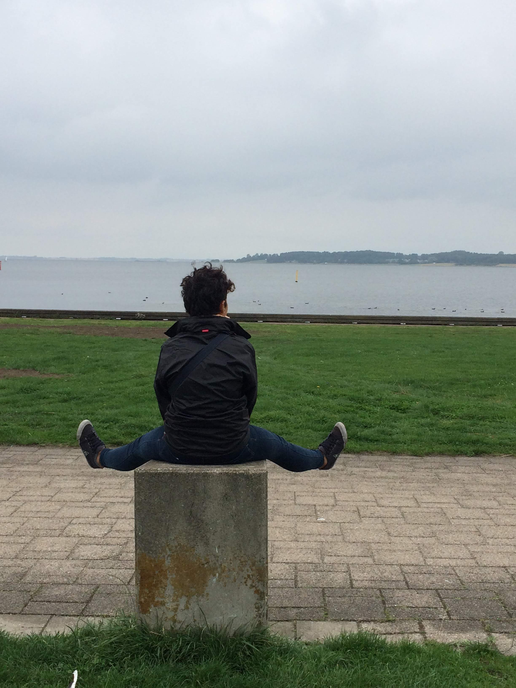
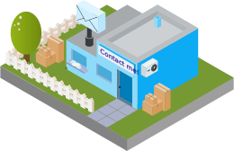
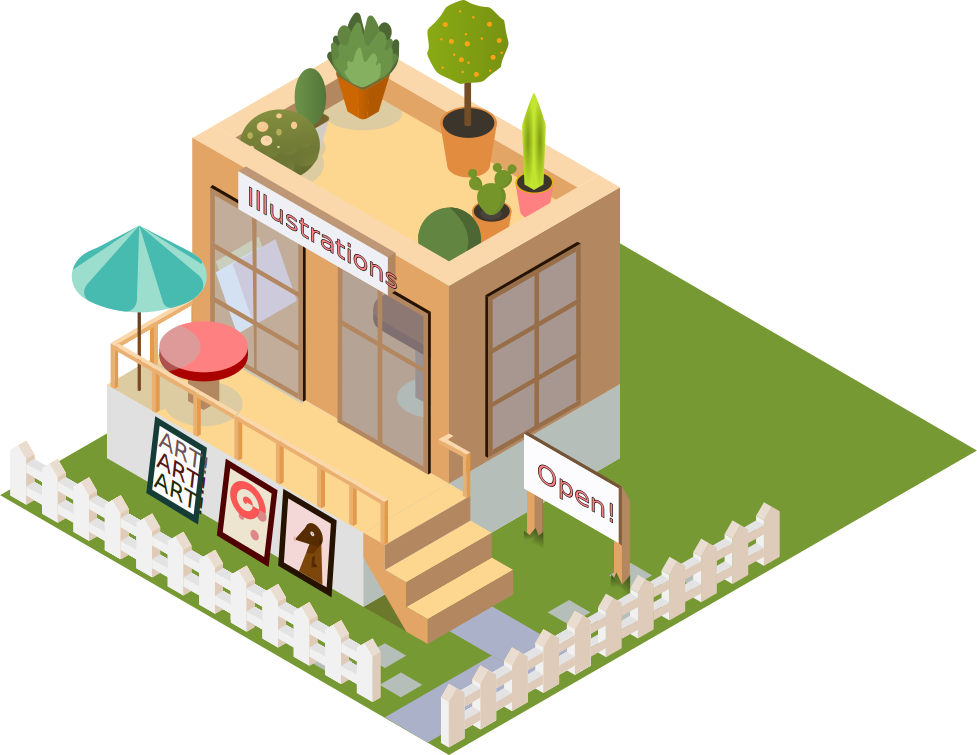
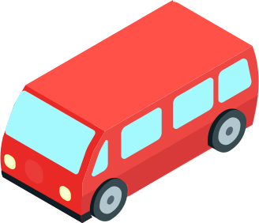

# Cecilia Baldoni

<br>



I am a researcher at the [Max Planck Institute of Animal Behaviour](https://www.ab.mpg.de/) where I explore how brain and environment shape how animals think.<br><br>

Beyond the lab, I lead community operations and open science initiatives. My work focuses on building the technical systems and professional networks that allow researchers to share knowledge and automate their workflows at scale.

**Dive into the interactive city below to explore my projects, workshops, open science efforts, and community activities**.<br><br>


```{=html}
<div style="text-align: center; margin: 0 0 24px 0;">
  <div style="display: inline-flex; align-items: center; gap: 10px; padding: 7px 15px; box-shadow: 0 0 0 2px #e8c97e, 0 0 0 5px #0f3318; border-radius: 6px; background: #0f3318; font-family: 'Space Grotesk', sans-serif; margin: 6px;">
    <svg width="16" height="16" viewBox="0 0 24 24" fill="none" stroke="#e8c97e" stroke-width="2" stroke-linecap="round" stroke-linejoin="round"><path d="M8 21h8m-4-4v4M5 3h14l-1 7a6 6 0 01-12 0L5 3z"/><path d="M5 3a2 2 0 00-2 2v1a4 4 0 004 4h.5M19 3a2 2 0 012 2v1a4 4 0 01-4 4h-.5"/></svg>
    <span style="font-size: 16px; color: #fdf6ee; font-family: 'Space Grotesk', sans-serif;">
      <strong style="color: #e8c97e;">Best Interactive Website</strong> · <a href="https://theacademicdesigner.com/2025/winners-of-the-best-personal-academic-websites-contest-2025/" style="color: #a3be6e; font-weight: 600; text-decoration: underline;">Best Personal Academic Websites Contest 2025 ↗</a>
    </span>
  </div>
</div>
```


## Explore the City

```{=html}
<div class="city-wrapper">
  <div class="city-layer">
    

    <a href="content/contact.qmd" class="city-icon icon-contact">
      
      <span class="city-label">Get in Touch!</span>
    </a>

    <a href="content/about.qmd" class="city-icon icon-home">
      
      <span class="city-label">About Me</span>
    </a>

    <a href="content/illustrations.qmd" class="city-icon icon-illustration">
      
      <span class="city-label">Illustrations</span>
    </a>

    <a href="content/open-science.qmd" class="city-icon icon-open-science">
      
      <span class="city-label">Open Science</span>
    </a>

    <a href="content/project.qmd#current-research" class="city-icon icon-research">
      
      <span class="city-label">Projects</span>
    </a>

    <a href="content/talks.qmd" class="city-icon icon-talks-workshops">
      
      <span class="city-label">Talks and Workshops</span>
    </a>
    
    <a href="content/publications.qmd" class="city-icon icon-bookshop">
      
      <span class="city-label">Publications</span>
    </a>
    
    <a href="content/media.qmd" class="city-icon icon-radio">
      
      <span class="city-label">Media</span>
    </a>
    
    <a href="blog/index.qmd" class="city-icon icon-blog">
      
      <span class="city-label">Blog</span>
    </a>
    
    <a href="content/contact.qmd#book-a-time-to-chat" class="city-icon icon-coffee">
      
      <span class="city-label">Book a Time to Chat!</span>
    </a>
  </div>
</div>
```
